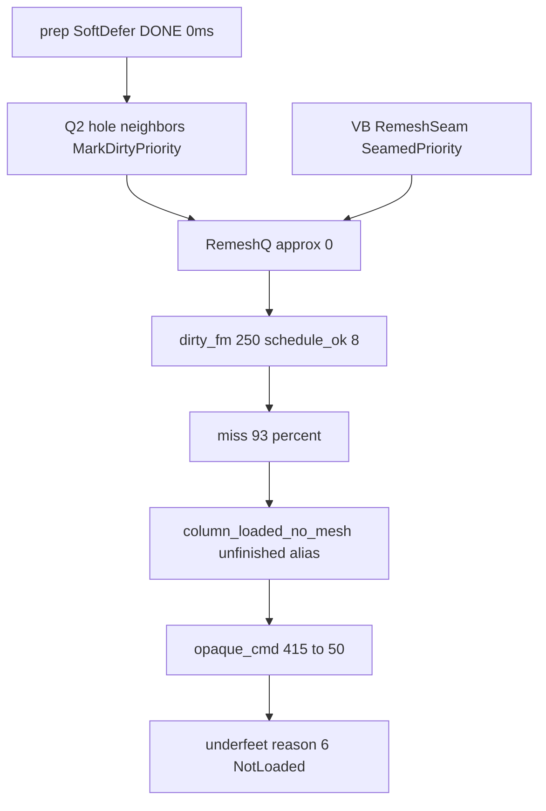

# План: хвосты cruise SoT после hotfix SoftDefer (пост-201626)

## Хвосты исходного плана vs факт

| Исходная фаза | Код | DoD на `201626` | Статус |
|---|---|---|---|
| 0 Diagnosis | audit + `softdefer_empty_scan/own` | setup mystery закрыта | **done** |
| 1 SoftDefer prep | POD + Set* once; rim-slice **откатили** (flicker); latch `CreateSpawnWarmupSettled` | prep hot **0.002** (цель ≤20) | **done** |
| 2 Dirty class / RemeshQ | SoftDefer seam → `MarkDirty` only | `dirty_remesh` **0**, miss **93%**, `schedule_ok` **8** | **хвост** |
| 3 Underfeet lease | CancelOutside/KeepDirty `keep_horiz≤1` | late opaque med **226**, uf miss **45%**, reason **6** sticky | **хвост** |
| 4 Docs/A/B | docs + audit | opaque vs `184340` **не зелёный** | **хвост** |

**Hotfix подтверждён на `201626`:** `prep_softdefer_setup` **0.0003**, emerge **52**, wall **191/297**. Картинка/дыры — нет.

## Поправки к диагнозу (после 201626)

1. **`underfeet_reason=6` = `NotLoaded`**, не GpuInFlight (5=`GpuInFlight`, 6=`NotLoaded`, 7=`NotReadyState`).
2. SoftDefer seam `MarkDirty` уже есть — мало: другие пути промоутят Remesh→FirstMesh.
3. `column_loaded_no_mesh` = алиас unfinished (`FocusNotRenderReady`).
4. `opaque_cmd_on` = MDI CPU refs; GpuPacked рисуется отдельно — коллапс 415→53 при `disc=0` может быть telem + реальный unfinished.

## Фазы

### Phase A — RemeshQ truth (хвост Phase 2)

**Цель:** vb>25 → `dirty_remesh` med>0; miss% ≤47%.

1. Q2 (~L2757 в Coordinator): drawable hole neighbor → **`MarkDirty`**.
2. RemeshSeam / VB heal для drawable lit → `MarkDirty` / non-Priority seamed; Priority только missing/FullyDark.
3. RAA lit drawable → `MarkDirty` (Closeout C).
4. StarveRemesh: не вычищать lit RemeshQ внутри keep horiz.
5. Тесты dual-Q + опционально `dirty_promote_fm_n` telem.

### Phase B — SoftDefer empty ownership storm

**Цель:** не заливать FirstMeshQ сверх прогресса.

1. Не re-`MarkDirtyPriority` каждый кадр на sticky Owned.
2. Не дублировать ColumnFlow FirstMesh если Contains.
3. Full-disk scan оставить (~0.27 ms OK).

### Phase C — Opaque / underfeet SoT

**Цель:** late opaque≥200; uf miss≤15.

1. Telem: `opaque_gpu_packed_n` / `opaque_draw_n` = MDI + packed.
2. Underfeet NotLoaded(6): учесть GpuPacked/PendingGpu в `GetColumnRenderableState`.
3. Retain underfeet drawable until replacement (без PreferKick).

### Phase D — A/B lock

1. Обновить `docs/streaming_cruise_sot.md` (reason enum, packed opaque, call sites).
2. Fresh inland enter (−485/50), не продолжение (−492,55).
3. `bin/audit_cruise_sot.py` vs `184340` / `201626` / новый лог.

## Порядок

A → B → C → D.

## Вне скоупа

Ocean Era30 / LOD; abort walls; enter SoftDefer lift > r≤2; повторный rim-slice SoftDefer empty.
