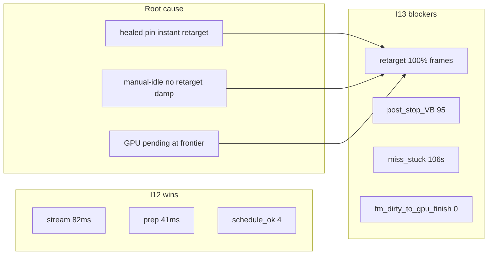

# I13: Frontier flicker zero + witness unstuck

**База:** commit `f1498482` (I12)  
**Gate of record:** FP-manual PASS на ручном no-teleport пролёте World_164 ≥2 мин  
**Baseline ручной I12:** `perf_20260830-150840_16380.jsonl`  
**Baseline ручной I11:** `perf_20260830-134006_30332.jsonl`

---

## Контекст I12 → I13

| Метрика | I11 `134006` | I12 `150840` | Цель I13 |
|---------|--------------|--------------|----------|
| `stream_ms` med | 131 | **82** | ≤90 (держать) |
| `prep_refresh` med | 68 | **41** | ≤45 (держать) |
| `schedule_ok` med | 0 | **4** | ≥3 (держать) |
| `holes_rate` | 0.41 | **0.98** | ≤0.55 |
| `miss_stuck` max | 304s | **106s** | ≤60s |
| `post_stop_VB` max | 28 | **95** | ≤10 |
| `fm_dirty_to_gpu_finish` max | 0 | **0** | ≥1 |
| `softdefer_capture_retarget` steady | — | **100%** frames | ≤30% |
| `chunk_meshed_unlit` med | — | **2** | ≤1 |

**Диагноз I12 manual:** perf diet выиграл, но **capture retarget каждый кадр** (healed pin → instant hop) + **VB stop не дожат** + **holes gate на unfinished_visual при rim witness**.

---

## I13-A: Frontier capture stability (приоритет 0)

**Симптом:** мигание чанков при входе / перед входом.  
**Телем:** `softdefer_capture_retarget_n=1` на 256/256 steady; `capture_retarget_blocked_ratio=0.41`.

### A1. Heal cooldown (AntiFlickerPolicy)

`ShouldRetargetSoftDeferCaptureWitness`: при `!pinned_still_empty_or_miss` требовать `pin_age ≥ 4f`, кроме `visual_holes`.

### A2. Ingress GPU hold

`ShouldBlockCaptureRetargetForIngressGpuPending`: при `nh≤4` и `PendingGpuApply|Inflight` — не retarget witness.

### A3. Rim-idle damp

`ShouldDampWitnessRetargetOnRimIdleCruise`: manual-idle + `miss_horiz≥3` + `!visual_holes` → `better_horiz=false`.

### A4. Телем

Расширить `SoftDeferCaptureRetargetBlockedN` на ingress-GPU block; spike: `ingress_capture_retarget_held_n`.

**Gate A:** `softdefer_capture_retarget` share ≤30% steady; `chunk_meshed_unlit` med ≤1.

---

## I13-B: Witness unstuck

- B1: `ShouldRetireStaleRimMissWitness` age 600→300f
- B2: retire сбрасывает probe hold
- B3: SLA kick после 3× retarget без drawable
- B4: gate `rim_witness_latched` share ≤50% при `visual_holes=0`

**Gate:** `miss_stuck ≤60s`

---

## I13-C: GpuFinish chain (хвост I12-D)

- C1: `FmDirtyGpuWatch_` sync/immediate path
- C2: FM scheduled → GpuFinish SLA 120f
- C3: coord mismatch forensics

**Gate:** `fm_dirty_to_gpu_finish_n max ≥1`

---

## I13-D: VB stop drain (хвост I12-E)

- D1: stop `mesh_drain` floor 24 при `vb_nt>40`
- D2: ticketed consume каждый кадр на stop (no cadence 4f)
- D3: verify relight apply не обходит gpu_finish guard

**Gate:** `post_stop_visible_black_max ≤10`

---

## I13-E: Streaming lag

- E1: `stream_speed_clamp` floor 0.85 при rim idle diet
- E2: prefetch при `schedule_ok≥3 && !visual_holes`
- E3: разметить ~35ms untimed prep (witness pin path)

**Gate:** late segment `stream_ms ≤85`; `phase_budget_over ≤50%`

---

## I13-F: Gate + parity

- `bin/research_flight_20260829/13_i13_parity.md`
- Holes gate: `visual_holes` SoT при rim witness (не `unfinished_visual`)
- Visual sub-gates: `capture_retarget_rate`, `ingress_flicker`

---

## Файлы

| Файл | Фазы |
|------|------|
| [`AntiFlickerPolicy.h`](src/World/Streaming/AntiFlickerPolicy.h) | A |
| [`RelightFifoPolicy.h`](src/World/Streaming/RelightFifoPolicy.h) | A, B |
| [`WorldStreaming.cpp`](src/World/Streaming/WorldStreaming.cpp) | A, B, E |
| [`SoftDeferEmptyPolicy.h`](src/World/Streaming/SoftDeferEmptyPolicy.h) | B |
| [`ChunkMeshCache.cpp`](src/Render/Mesh/ChunkMeshCache.cpp) | C |
| [`ChunkEmergeCoordinator.cpp`](src/World/Streaming/ChunkEmergeCoordinator.cpp) | D |
| [`PhysicsTelemetry.h`](src/World/Physics/PhysicsTelemetry.h) | A, F |
| [`MissFirstMeshClassTest.cpp`](src/Test/MissFirstMeshClassTest.cpp) | A, B |

---

## Definition of Done (I13)

- [ ] FP-manual PASS (≥2 мин пролёт)
- [ ] `holes_rate ≤ 0.55` (visual_holes SoT)
- [ ] `stream_ms med ≤ 90`, `prep_refresh med ≤ 45`, `schedule_ok med ≥ 3`
- [ ] `miss_stuck_max_run_sec ≤ 60`
- [ ] `post_stop_visible_black_max ≤ 10`
- [ ] `softdefer_capture_retarget` steady share ≤30%
- [ ] `fm_dirty_to_gpu_finish_n max ≥ 1`
- [ ] Unit tests PASS
- [ ] Commit + I13 section в decision memo
