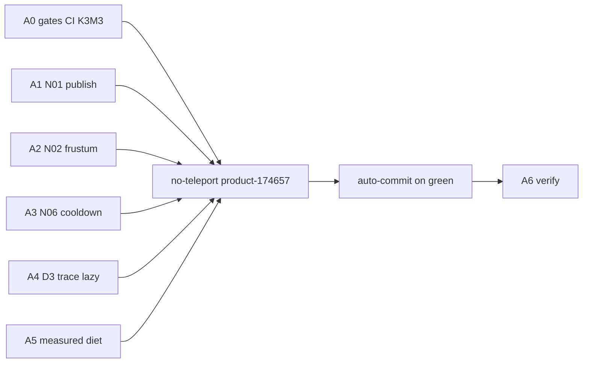

# Audit-first wall + correctness (после 154921) — детальный план

Источник приоритетов: [`docs/streaming/CURRENT_STATE_AUDIT_2026-09-14.md`](docs/streaming/CURRENT_STATE_AUDIT_2026-09-14.md) (HEAD аудита `420335e9`). Visual SoT: manual [`154921`](bin/suite_reports/g1_a10_relight/dual_lane_s4_manual_154921.json). Ветка: `cursor_audit_impl4`.

**SoT плана (открывать этот файл в репо):** [`.cursor/plans/west_cruise_wall_diet.plan.md`](.cursor/plans/west_cruise_wall_diet.plan.md)  
Копии в `%USERPROFILE%\.cursor\plans\west_cruise_wall_diet_*.plan.md` могут быть недоступны из UI — игнорируйте их.

## Протокол исполнения (обязательный)

### No-teleport autofly (контроль каждого исправления)

Канон west proxy (НЕ `land-cruise`, НЕ `--replay-manual` yaw 90):

```powershell
python tools/flight_sim_run.py --world World_164 --scenario product-174657 `
  --report bin/suite_reports/g1_a10_relight/wall_diet_<step>_<cold|warm>.json
```

Сценарий сам форсит: resume `World_164`, `--no-teleport-cruise`, yaw **180**, `hold_space=False`, `cruise-eye-y=56`, idle15/fly38/stop20, pin ~(7,3). Запрещено: `--teleport-cruise`, `land-cruise` как gate of record, north yaw 90 как west proof.

| Когда | Прогон | Report path pattern |
|---|---|---|
| После A0 (K3/M3 + CI/tools) | **cold** | `wall_diet_a0_cold.json` |
| После A1 / A2 / A3 | **cold** каждый | `wall_diet_a{1,2,3}_cold.json` |
| После A4 | **cold + warm** | `wall_diet_a4_cold.json`, `wall_diet_a4_warm.json` |
| После A5 | **cold + warm** | `wall_diet_a5_*` |
| A6 closeout | cold + warm + manual eye | `wall_diet_a6_*` + docs |

**Autofly green (regress class dual-lane S1/S3):**

- Adequacy proxy PASS (`focus_missing` med ≥1, `miss_stuck` ≥100, `fog_rd` ≥3, VB med ≥40, `player_y` 45–70, west Δcx ≥3)
- StaleVL fly med ≤ **84.5**; VB ≤ **84.5**
- unlit max ≤ **15** cold / ≤ **19** warm (якорь 125331)
- dirty_remesh ≤ **60**
- строго лучше P3 cold `133817` (StaleVL 94.5)
- Не объявлять `product_g1_vs_141350=CLOSED`

**Стоп-линия:** adequacy FAIL или StaleVL/VB/unlit хуже dual-lane class → не коммитить шаг; откат или ≤3 fix-итерации в том же шаге.

### Auto-commit протокол

- Один (или 2 связанных) commit **на завершённый шаг A0–A6** после green unit + required autofly.
- **Не** коммитить на красном ctest/autofly.
- В code-коммиты: `src/**`, `tools/**` (для A0), unit tests, `bin/suite_reports/g1_a10_relight/wall_diet_*` reports.
- **Не** коммитить сырые `bin/logs/perf_*.jsonl` целиком (указать путь в report/docs).
- Без `--amend`, без push, без `--no-verify`.
- Сообщения (префиксы как dual-lane S0–S4):

| Шаг | Message |
|---|---|
| A0a | `test: fail-closed Q9/Phase57 and CI cursor_audit_impl*` |
| A0b | `fix: align K3/M3 remesh demand with dual-lane steal` |
| A1 | `fix: atomic chunk-pass publish on partial batch OOM` |
| A2 | `fix: extract frustum planes from clip matrix rows` |
| A3 | `fix: structural column flow cooldown identity` |
| A4 | `perf: schedule-policy substages and lazy spawn readiness` |
| A5 | `perf: diet measured schedule-policy / stream scans` |
| A6 | `docs: freeze wall-diet track vs 154921 audit` |

### Жёсткие запреты

- Не FM-first / не возвращать `ShouldDeferRemeshSnapshotForFocusMiss`
- Не SoftDefer/floors «от дыр»; не weaken VB/focus_missing/holes/enter
- Не поднимать `StreamingPhaseBudgetMs` / Capture caps ради FPS
- Не PASS по: shadow_mismatch=0, oldest age от чужого finish, north proxy, тройной один JSONL, lower wall при пропавшей геометрии
- Dual-lane order KEEP; RemeshLit progress KEEP
- VB/StaleVL — census proxies (N04); не эскалировать remesh budgets от VB alone



---

## Корреляция с аудитом (кратко)

| Тема | Аудит | Этот план |
|---|---|---|
| FPS резерв | `prep_schedule_policy` ~22 ms; stream residual | A4 measure → A5 diet |
| Correctness first | D0/D1 до упрощения защит | A0–A3 до A5 |
| Dual-lane | KEEP; K3/M3 fix | A0b |
| Lazy spawn | первое безопасное perf change | A4 |
| Soft-exit / scans | только после substage evidence | A5 |
| Oracle / owner / FrameWorkContext | D2/D4/D5 | follow-up, не этот трек |

---

## A0 — D0: baseline + gates (N08 / N12 / N07)

### A0.0 Manifest visual baseline (docs, до code)

Зафиксировать в `bin/suite_reports/g1_a10_relight/wall_diet_baseline.md` (или README секция):

- SHA `420335e9` + текущий HEAD на старте исполнения
- Visual anchor 154921: corridor `(7,3)→(−3,3)`, operator PASS, wall med ~71, `prep_schedule_policy` med ~21.7 на audit filter (`2<speed<20`, `-3<=focus_cx<=6`, `player_y>=54`)
- exe SHA256 из аудита (если exe на диске) — identity, не auto-link к 154921
- Config: World_164, VSync/HUD как в прогоне; GPU AMD iGPU class
- Targets трека: после A5 `prep_schedule_policy_ms` med ≤10; `mesh_emerge_ms` ≤16; `wall_ms` med ≤50 на том же filter — comparative

### A0.1 N08 — Q9 / Phase57 fail-closed

Файлы:

- [`tools/q9_acceptance_suite.py`](tools/q9_acceptance_suite.py) — `drawable_ok` ~112–124: сейчас `mesh_apply_stale_med` только `is not None` (контрпример stale=999999 → True). Добавить: upper bound / required unfinished+holes presence; enter/pool timeout в verdict; запрет acceptance на diagnostic.
- [`tools/AnalyzePhase57Scorecard.py`](tools/AnalyzePhase57Scorecard.py):
  - `validate_run_inputs` ~622–667: missing/null/non-bool hard gates → fail-closed
  - schema `finite_number` ~158–178: отвергать negative `wall_ms`
  - `evaluate_hard_gates` ~670–698: empty gates ≠ PASS
  - teleport: сверять CLI `--teleport false` с manifest; mismatch → INVALID
  - duplicate `(run_id, interval)` / reuse одного JSONL трижды → reject или DIAGNOSTIC only
- [`tools/test_AnalyzePhase57Scorecard.py`](tools/test_AnalyzePhase57Scorecard.py) + Q9 fixtures: partial raw, NaN, forged hash, teleport mismatch, duplicate intervals

Verify: `python tools/test_AnalyzePhase57Scorecard.py` PASS.

Commit **A0a** после unit tooling green (autofly не обязателен для чистого tools-only, но cold желателен если трогали только CI ниже вместе).

### A0.2 N12 — CI branch coverage

[`.github/workflows/windows-release-smoke.yml`](.github/workflows/windows-release-smoke.yml) line 5:

```yaml
# было: cursor_audit_impl
branches: [main, master, thread_chunks, 'cursor_audit_impl*', 'codex/**', 'perf/**', 'feature/**']
```

Exact name не wildcard — нужен glob `'cursor_audit_impl*'`.

### A0.3 N07 — K3/M3 demand contract

**Падающие asserts** (сейчас 25/26): [`src/Test/StreamingRenderReadyInvariantsTest.cpp`](src/Test/StreamingRenderReadyInvariantsTest.cpp) **474–502**

- Fixture `rim_stale`: `dirty_fm_n=16`, `nearest_miss_horiz=5`, cooled pending, **`remesh_queue_n` default 0**
- Expect `remesh_schedule >= 2` (K3/M3)

**Production steal** [`MeshWorkAdmission.h`](src/World/Streaming/MeshWorkAdmission.h) **990–1003**:

```cpp
if (steal_fm || in.remesh_queue_n <= 0)
  out.remesh_schedule = 0;  // отдаёт quota FM
```

**Контракт (выбранный):** rim +1 remesh требует реальный remesh demand (`remesh_queue_n > 0`) **или** documented reserve slot. Исправление:

1. В fixture K3/M3 выставить `remesh_queue_n` ≥ 1 (и при необходимости dirty remesh signal), сохранив rim miss / cooled pending.
2. Добавить явный unit: `remesh_queue_n==0` + rim → remesh_schedule==0 (steal path) — документирует dual-lane.
3. Согласовать helper-тесты в [`MissFirstMeshClassTest.cpp`](src/Test/MissFirstMeshClassTest.cpp) **2346–2432**: `protect_remesh_floor` не должен молча раздувать cap; либо clamp `remesh≤cap`, либо overload reason (минимум — assert документированного поведения).

Verify:

```powershell
ctest --test-dir build/desktop-msvc -C Release -R "streaming_render_ready_invariants|MissFirstMesh" --output-on-failure
# затем полный streaming набор → 26/26
ctest --test-dir build/desktop-msvc -C Release -L streaming --output-on-failure
```

Autofly: **cold** `wall_diet_a0_cold.json`. Auto-commit **A0b**.

---

## A1 — N01: atomic multi-batch publish

Файл: [`src/Render/Engine/GreedyGpuPublication.cpp`](src/Render/Engine/GreedyGpuPublication.cpp) `PublishPassInputs` **142–259**

Текущий дефект:

- Успех **любого** batch → `published_ok.insert(ref.chunkCoord)` (**216**)
- При `any_fail` erase dirty для всех `published_ok` (**237–240**) → соседний batch того же чанка остаётся со старым predecessor; retry без dirty не чинит (audit repro `a=18 b=9 dirty=0`)

**Fix:** транзакционная единица `chunk + pass + target revision`:

1. Группировать inputs по `chunkCoord` (pass cache уже pass-local).
2. Staging всех batches группы; commit группы только если **все** требуемые batches pooled OK.
3. При partial OOM: не erase `PendingGeometryDirty` для этой coord; не advance pass revisions / publicationVersion для смешанной группы; retain predecessors; соседние coords независимы.
4. Release старых allocations только после согласованной группы + readers (существующий fence/lifetime KEEP).

**Regression:** расширить [`src/Test/GreedyVertexPoolProductionTest.cpp`](src/Test/GreedyVertexPoolProductionTest.cpp) (сейчас только single-batch OOM). Портировать audit repro: 2 batches A/B, cap mid-flight, assert dirty retained + old B stuck until full success; соседний chunk progress OK.

Verify: unit production test + cold autofly `wall_diet_a1_cold.json`. Commit **A1**.

---

## A2 — N02: frustum row extraction

Файл: [`src/Render/Camera/Frustum.h`](src/Render/Camera/Frustum.h) **15–33**

Сейчас: `m[3]±m[i]` = **columns** GLM. Нужно: плоскости из **rows** `projection*view` (row3±row0/1/2). Call sites KEEP без transpose: [`GeometryEngine.cpp`](src/Render/Engine/GeometryEngine.cpp) ~1569/1824, [`WorldMeshService`](src/World/Mesh/WorldMeshService.cpp), [`CreatureDrawPass`](src/Render/Engine/CreatureDrawPass.cpp).

**В этом коммите:**

- Исправить extraction + clip-space unit (камера `(100,50,100)`, look −Z, FOV 60, AABB @ `(100,50,80)` → inside)
- **Сохранить** distance bypass и skip near/top/bottom в `IntersectsChunkAABB` (**49–70**) и зеркало в [`GpuFrustumCull.cpp`](src/Render/Engine/GpuFrustumCull.cpp) — не снимать guards вместе с math (аудит D1.2)
- Overdraw / radius diet — только follow-up D6 после A6

Новый test TU или секция в существующем: translated camera, both sides of plane, perspective resize; CPU/GPU parity optional smoke.

Verify: unit + cold autofly `wall_diet_a2_cold.json` (visual regress gate критичен — cull math). Commit **A2**.

---

## A3 — N06: structural cooldown key

Файлы:

- [`ColumnFlowExecutor.cpp`](src/World/Streaming/ColumnFlowExecutor.cpp) **353–361** `CooldownKey`; callers Enqueue **341–347**, Dispatch **399**, erase **501**
- Decl: [`ColumnFlowExecutor.h`](src/World/Streaming/ColumnFlowExecutor.h) **118**

Сейчас: `(ux<<32)|(uz<<8)|kind` — коллизии `(-1,-1)==(-2,-1)` для kind=1.

**Fix:** structural key `{int32 x, int32 z, WorkKind}` с equality по всем полям; hash может коллидировать. Заменить `unordered_map<int64_t,…>` на map по struct key.

**Tests:** новый executor cooldown model test (не только [`ColumnFlowSchedulerTest`](src/Test/ColumnFlowSchedulerTest.cpp) heap): negative Z, adjacent negative X, int32 edges, different kinds не делят cooldown.

Verify: unit + cold autofly `wall_diet_a3_cold.json`. Commit **A3**.

---

## A4 — D3: trace critical path + lazy spawn readiness

### A4.1 Substage timers (measure first)

В [`ChunkEmergeCoordinator.cpp`](src/World/Streaming/ChunkEmergeCoordinator.cpp) else schedule-policy **2053–2541** (`schedule_policy_t0` @1968 → `prep_schedule_policy_ms` @2541):

Добавить `prep_sched_*_ms` + visit counts минимум для:

- heavy cadence / `ShouldForceScheduleHeavyWalk`
- `request_drop_remesh` / DropRemesh walks
- CancelAsync flush
- hole-force / MarkDirty scans
- `IsSpawnMeshRingReady` / `ShouldSuppressRelightSeamDirtyForEnterGate` (**2101–2104**)
- оставшийся «other»

Экспорт в PhysicsTelemetry + [`FramePerfMonitor.cpp`](src/World/Diagnostics/FramePerfMonitor.cpp) JSONL (рядом с `prep_schedule_policy_ms` ~1007/1644).

### A4.2 Stream residual scopes

- [`WorldViewBinding.cpp`](src/World/Core/WorldViewBinding.cpp) **1034–1057**: разделить timing `UpdateStreaming` vs `TickAsyncChunkSystems` vs post-`BeginFrame` (сам перенос BeginFrame — **не** в A4; это D5)
- [`WorldStreaming.cpp`](src/World/Streaming/WorldStreaming.cpp): крупные подэтапы census/scan если residual ≥ X ms

### A4.3 GPU ms wipe

[`ChunkMeshCache.cpp`](src/Render/Mesh/ChunkMeshCache.cpp) ~**5031**: не zero `LastMeshGpuKickMs` / FinishMs при `skip_gpu_consume=true` (emerge ~5492) — иначе телеметрия врёт на skip frames.

### A4.4 Первое безопасное perf-изменение (аудит D3.3)

В **2101–2104**: не вызывать `IsSpawnMeshRingReady()` когда `!IsEnterLitGateActive()` — short-circuit в `ShouldSuppressRelightSeamDirtyForEnterGate` / call site:

- decision table: enter inactive → suppress зависит только от `base_suppress`; enter active → прежняя семантика ring_ready
- Regression: callback-count / truth-table unit (не обещать −22 ms)

Определение `IsSpawnMeshRingReady`: [`World.cpp`](src/World/Core/World.cpp) **6180+** (дорогое — ring/async/dirty).

Verify:

```powershell
ctest ... -L streaming
python tools/flight_sim_run.py --world World_164 --scenario product-174657 --report .../wall_diet_a4_cold.json
python tools/flight_sim_run.py --world World_164 --scenario product-174657 --report .../wall_diet_a4_warm.json
```

Сравнить period dump `prep_sched_*` vs 154921 class. Commit **A4**.

---

## A5 — Measured policy / stream diet (только после A4 evidence)

Вход: dominant substage из A4 cold/warm (какой `prep_sched_*` ≥ X ms).

| Если dominant | Действие |
|---|---|
| Spawn readiness / repeated getters | once-per-frame memo с полным ключом (focus/dirty/enter state); не менять decisions |
| Heavy walks после `prep_deadline_hit` | mid-body soft-exit при `allow_schedule_soft_exit` (**2014–2015**) + RemeshLit progress жив (`ok_remesh≥1` или RemeshQ); **не** full shed under FocusMissing holes |
| Stream residual scans | один SoT census missing/sticky/pending на кадр (I9/I12 spirit); не boost Capture |

Gates (stop-the-line → revert A5, не крутить thresholds):

- Autofly cold+warm ≤ dual-lane class (см. протокол)
- `prep_schedule_policy_ms` med ≤ **10** на audit route filter
- `mesh_emerge_ms` ≤ **16**; `wall_ms` med ≤ **50** (comparative)
- Visual: не хуже 154921 class по operator/proxy proxies

Commit **A5** только на green; иначе revert commit / не оставлять half-diet.

---

## A6 — Verify + freeze

1. `ctest -L streaming` **26/26** Release
2. Cold+warm `product-174657` → `wall_diet_a6_cold.json` / `_warm.json`
3. Опционально Phase57 diagnostic (не acceptance PASS на forged):  
   `python tools/AnalyzePhase57Scorecard.py --report ... --perf ... --teleport false`
4. Manual west eye (оператор) vs 154921 corridor
5. Docs: [`FLIGHT_F5_174657_RETEST.md`](docs/streaming/FLIGHT_F5_174657_RETEST.md), [`AUDIT_CLOSURE_REVIEW_2026-09-12.md`](docs/streaming/AUDIT_CLOSURE_REVIEW_2026-09-12.md), [`bin/suite_reports/g1_a10_relight/README.md`](bin/suite_reports/g1_a10_relight/README.md), pointer на CURRENT_STATE_AUDIT — **не** заявлять G1 CLOSED / Q9 complete / oracle done

Commit **A6** docs + reports.

---

## Follow-up (вне трека)

| ID | Тема |
|---|---|
| D2 / N04 / N11 | visibility/light oracle; async cull pass identity/barriers |
| D4 / N05 / N09 | ChunkRenderRecord owner; relight immutable catalog; secondary FullyDark writers |
| D5 / N03 / N07 / N10 | `FrameWorkContext` до UpdateStreaming; сквозные quotas; fairness rolling window |
| D6 | distance/plane guard diet после N02+oracle |
| S5 | `ok_fm=0` consumer fairness после D5 |

---

## Критерий успеха трека

- Доказанные P1 **N01/N02/N06/N07/N08/N12** закрыты или fail-closed
- Каждый code-шаг подтверждён **no-teleport** `product-174657` и **auto-commit** на green
- Visual 154921 class не откатился
- Schedule-policy/stream измерены (A4) и атрибутированно ужаты (A5) без order-toggle
- Аудит-порядок соблюдён: wall diet не опережает correctness
