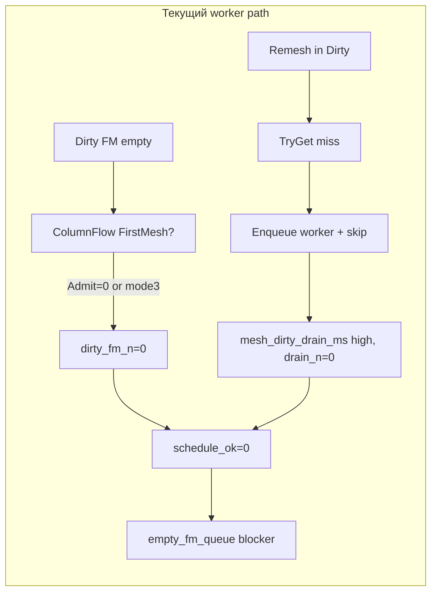

# Roadmap — mesh architecture SHIP (post NO-GO audit)

**HEAD:** `70cdb08e` · **Verdict:** код M0–M5 «на бумаге», реальный pipeline **не замкнут** — autofly NO-GO на M1/M4/parity.

## Диагноз: что сделано упрощённо

| Фаза | Заявлено | Факт в коде | Симптом в autofly |
| --- | --- | --- | --- |
| **H1** | parity по классу симптомов | `parity_within_2x` только wall/stream; holes 100% vs manual 95% | harness не ловит «вечные 12 unfinished» |
| **M1-1** | Ring prefetch MarkRelit → store | **нет кода** — только `mesh_capture_store_hit_n` telem | store_hit ≈ 0 |
| **M1-2** | Hard defer refresh_budget==0 | есть в `TakeOrRefresh`, но worker path **обходит** store | skip_snapshot вместо defer |
| **M1-3** | Incremental shell | `RefreshIncrementalShell` есть, **не wired** в schedule hot path | тест не в CMake |
| **M1-4** | empty_fm_queue guard | только `ComputeFmDirtyEnqueueReserve(0,0)>=2` — **не refill** | `dirty_fm_n=0`, blocker=empty_fm_queue |
| **M2a** | `ReadChunkBandForCapture` + epoch | **API отсутствует**; worker держит `const UBlockWorld*` | data race / hang risk |
| **M2b/c** | TryGet only; fallback ≤1ms | на miss: enqueue → **skip schedule** (`skip_snapshot`) | `schedule_ok=0`, drain 100ms, drain_n=0 |
| **M3** | GpuExtract 90%, no readback | только `BeginUploadFrame` + cap 64 | pool gate PASS случайно |
| **M4** | zero duplicate MarkDirty owners | guard на **1** path SoftDefer empty | Admit*/Recover/Refresh всё ещё MarkDirty |
| **M5** | Seed V3 + pending_light gate | существующий SeedDecision, **gate не прогнан** | pending_light_focus не измерен |

### Корневая причина NO-GO

**Admission mode3 97%** + **worker skip-on-miss** = pipeline не прогоняет work, но тратит emerge budget на drain/skip loop.

---

## SOTA vs Cubatarium (кратко)

| Практика | Industry (Veloren, Minetest, VoxelMVP, CrabbyGL) | У нас сейчас | Gap |
| --- | --- | --- | --- |
| Immutable band snapshot | memcpy 3×3 chunks, O(1) pin | `Capture(*world)` на worker с сырой ссылкой | **критический** — M2a не сделан |
| Producer-consumer | crossbeam / completed queue → main apply overlap | worker skip schedule до commit | **критический** — bubble вместо overlap |
| Single column owner | job graph: one enqueue path | ColumnFlow + Admit + SoftDefer + Recover | **высокий** — M4 partial |
| Priority mesh queue | nearest-first, physical cores | FirstMeshQ есть, но **пустая** (FM не попадает) | **высокий** |
| GPU-resident opaque | SSBO + compute cull + MDI | cpu_greedy + PBO pool | **средний** — M3 scope |
| Light-before-mesh | no drawable until lit | RenderReady V2 частично | M5 |

---

## План доработок (критический путь к SHIP)

### Sprint R1 — Разблокировать FM pipeline (M1 + M2 fix) · ~5–7 дней

**Цель:** `dirty_fm_med > 0`, `schedule_ok_med > 0`, `dominant_blocker ≠ empty_fm_queue`.

| ID | Задача | Файлы | Acceptance |
| --- | --- | --- | --- |
| R1-1 | **Worker schedule contract:** miss → enqueue worker, **не skip** — пометить `PendingCapture`, retry TryGet same frame после DrainCompleted | `ChunkMeshCache.cpp` | `mesh_dirty_schedule_ok_n > 0`; `skip_snapshot` не доминирует |
| R1-2 | **M2a API:** `ReadChunkBandForCapture(coord, CaptureToken)` — pinned 3×3 band, epoch discard | `BlockWorld`, `ChunkMeshSnapshot` | worker не держит `UBlockWorld*`; revision mismatch → drop |
| R1-3 | **Интеграционный тест:** `capture_worker_integration_test` в CMake + World_164 band + 60s soak | `CMakeLists.txt`, test | CI green |
| R1-4 | **FM refill:** если `dirty_fm_n==0` && `unfinished_visual>0` && ColumnFlow has FirstMesh ticket → force `AdmitFocusVisibleMissing(1)` | `ColumnFlowExecutor`, `MeshApplyPolicy` | `fm_dirty_enqueue_med > 0` на cruise |
| R1-5 | **Admission mode3 triage:** логировать причину mode3; ослабить carve-out когда worker pending capture (не голодать FM ради remesh) | `MeshWorkAdmission`, telem | `cruise_admission_mode3_share < 60%` |

**Gates:** `MESH-M1-capture` partial (blocker ≠ empty_fm_queue); `schedule_ok_zero_rate` ↓ 50% vs текущий.

---

### Sprint R2 — M2c + M1 store diet (полный) · ~4–5 дней

| ID | Задача | Acceptance |
| --- | --- | --- |
| R2-1 | M1-1: prefetch MarkRelit на ring enter → `CaptureStore.Commit` async (worker) | `store_hit_rate` med ↑ vs R1 baseline |
| R2-2 | M1-3: wire `RefreshIncrementalShell` для neighbor-only dirty | `capture_incremental_test` в CMake PASS |
| R2-3 | M2c: удалить `TakeOrRefresh` из hot `try_schedule`; degraded path только `kWorkerSaturated` + budget ≤1ms | main `mesh_snapshot_ms` < 0.5ms sustained |
| R2-4 | 30 min `fz-manual-long` soak без hang | exit 0, no truncated jsonl |

**Gates:** `MESH-M2-worker` + `MESH-M1-capture` GO (emerge ≤35, holes ≤50% interim).

---

### Sprint R3 — M4 ownership closure · ~5–7 дней

| ID | Задача | Acceptance |
| --- | --- | --- |
| R3-1 | `lint_mark_dirty_ownership.py` — **fail CI** на новые paths | duplicate owners = 0 |
| R3-2 | M4a: убрать `MarkDirty*` из `AdmitFocusVisibleMissing` → только `MarkDirtyFirstMesh` via ColumnFlow drain | grep clean |
| R3-3 | M4b: `RemeshSeam` только через `ColumnFlowExecutor::AdvanceColumn` | SRBR orphan audit = 0 |
| R3-4 | M4c: `MeshWorkAdmission` читает `ColumnJobStage` для cap/skip | policy unit tests |
| R3-5 | Расширить `BlockParallelMarkDirtyForColumnFlow` на все Admit/Recover/Refresh paths (не только SoftDefer empty) | `column_owner_audit.py` PASS |

**Gates:** `MESH-M4-ownership` GO — holes ≤10%, `witness_latch_diet_share ≥ 70%`.

---

### Sprint R4 — H1 harness truth + M5 · ~3–4 дня

| ID | Задача | Acceptance |
| --- | --- | --- |
| R4-1 | Autofly: записывать `movement_speed` / `LastMovementSpeed` в perf (I12-A0) | witness diet на autofly > 40% |
| R4-2 | Gate `MESH-parity-manual`: holes ≤ manual×1.15 + 5pp (как в плане §1.4.4), не фиксированные 55% | parity gate matches plan |
| R4-3 | M5: commit-time skylight seed V3 + `pending_light_focus_med` gate | FP-enter PASS + pending_light ↓50% stop |
| R4-4 | Manual sanity 2–3 min fly-only после R3 | log в `00_index.md` |

---

### Sprint R5 — M3 GPU residency (после M4 SHIP) · ~7–10 дней

Только после R3 GO — иначе оптимизируем пустой schedule.

| ID | Задача | Gate |
| --- | --- | --- |
| R5-1 | GpuExtract ≥90% opaque cruise | `gpu_extract_defer_rate` |
| R5-2 | Finish without mask readback (SSBO counters) | `gpu_mask_readback_med==0` |
| R5-3 | Adaptive readback ring | pending_gpu p95 |
| R5-4 | Draw prefers packed GPU refs | `opaque_gpu_packed_n` ↑ |

---

## KPI targets (fly segment)

| Метрика | Сейчас (replay-manual) | После R1 | После R3 SHIP | Gate I17 |
| --- | ---: | ---: | ---: | ---: |
| schedule_ok_med | 0 | ≥2 | ≥4 | — |
| dirty_fm_med | 0 | ≥1 | ≥3 | — |
| mesh_emerge_ms | 47 | ≤40 | ≤25 | 21 |
| holes_rate | 100% | ≤70% | ≤10% | ≤10% |
| empty_fm_queue share | majority | <50% | <5% | — |
| wall_ms_fly_med | 44 | ≤50 | ≤150→80 | 126 |

---

## Немедленные действия (день 1)

1. **Revert-risk bisect:** `kWorkerCaptureEnabled=false` → один autofly — подтвердить, что empty_fm_queue / schedule_ok связаны с worker skip path.
2. **R1-1 patch:** DrainCompleted **перед** schedule pass; pending capture coords retry в том же tick.
3. Добавить в telem: `mesh_pending_capture_n`, `mesh_worker_inflight_n`, `mesh_schedule_retry_after_capture_n`.
4. Прогнать trio autofly **строго последовательно** (не параллельно).

---

## Запрещено до R3 GO

- Закрывать TD-ARCH-046 как done без M2c soak
- M6 subchunk
- Смягчать gates holes до «100% OK» без снижения `unfinished_visual`
- Параллельные autofly на один `Cubatarium.exe`

## Research pack (долг)

- [ ] `04_hotspot_matrix.md` — spike × mesh stage
- [ ] `05_industry_scorecard.md` — этот документ + BEST_PRACTICES
- [ ] `raw/autofly_*.txt` — вывод phase gates

---

## Ссылки

- Исходный план: `mesh_perf_architecture_54fa9966.plan.md`
- Autofly reports: `bin/suite_reports/mesh_H0_*.json`
- Decision memo: `08_decision_memo.md`
