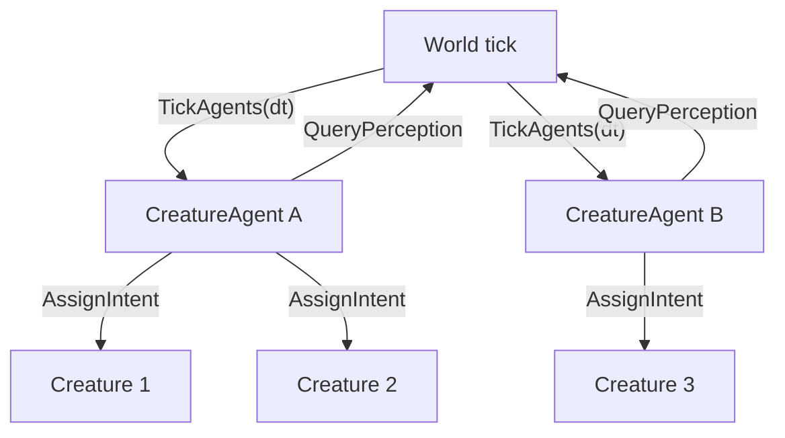

# Архитектура агентов существ (отложено)

Документ описывает **оркестрацию активности** существ в мире Cubatarium. Реализация **не входит** в текущую итерацию интеграции `Creature` (см. план `интеграция_creature`); в итерации B для `test_mob` допустим **временный** `MobController` внутри существа с явной пометкой «заменить на агента».

Связанные документы: [`ARCHITECTURE.md`](ARCHITECTURE.md), план Creature в `.cursor/plans/`, пошаговая реализация B — [`CREATURE_IMPLEMENTATION.md`](CREATURE_IMPLEMENTATION.md).

---

## Вопрос: кто «двигает» существ в мире?

| Подход | Суть | Плюсы | Минусы |
|--------|------|-------|--------|
| **Единый центр** | Один `WorldAI` / `GameDirector` знает всё и командует каждым NPC | Простая отладка, согласованность | O(N) каждый тик, узкое горло, «всезнание» |
| **Существо само** | ИИ внутри `Creature::Update()` | Локальность, понятная модель ООП | Дублирование, сложно шарить контекст мира, плохая cache locality при сотнях мобов |
| **Системы опроса (ECS)** | `PerceptionSystem` → `BehaviorTreeSystem` → `MovementSystem` по компонентам | Масштаб, разделение «мозг / исполнение» | Нужна дисциплина порядка систем; для Cubatarium пока нет ECS |
| **Агенты над группой** (ваше предложение) | Агент владеет множеством `Creature`; мир тикает агентов; агент опрашивает мир | Масштаб чанками, общий контекст на зону, слабая связь Creature↔ИИ | Доп. слой абстракции, нужны правила разбиения по агентам |

### Что рекомендуют в индустрии (кратко)

1. **Разделить решение и исполнение**  
   «Мозг» выдаёт цель (`Goal`, `Intent`), отдельные системы/контроллеры выполняют движение, атаку, анимацию ([ECS + BT](https://discussions.unity.com/t/ai-in-ecs-what-approaches-do-we-have/741984), [слои strategic/tactical/operational](https://discussions.unity.com/t/ai-in-ecs-what-approaches-do-we-have/741984)).

2. **Не класть тяжёлую логику в каждую сущность каждый кадр**  
   Когнитивный слой (BT, GOAP, utility) — реже и с хорошей локальностью данных; механика (path, collision) — каждый кадр, uniform ([ECS AI research](https://www.scribd.com/document/1014561570/ECS-AI-Execution-Architecture-Research)).

3. **Гибрид central + local**  
   Региональный координатор + автономные агенты на группу/NPC ([hierarchical multi-agent](https://www.auxiliobits.com/blog/agent-collaboration-models-centralized-vs-distributed-architectures/), [hive / regional edge](https://mygaming.cloud/designing-a-hive-mind-npc-game-dev-lessons-from-pluribus-sci)).

4. **Мир опрашивает через пространственный индекс**  
   AI Manager не знает о клиентах; сеть/рендер получают только позиции из общего индекса ([server-side AI spec](https://www.ismailguven.com/spec.php)).

5. **Избегать глобального «всезнания»**  
   Для социальных/репутационных механик — локальные belief sets, gossip O(log N), а не одна БД на весь мир ([NPC gossip 2026](https://techplustrends.com/ai-npc-gossip-protocol-social-graph-2026/)).

**Вывод для Cubatarium:** ваш вариант (агент на множество существ + мир опрашивает агентов) — это **иерархический гибрид**: не единый всемогущий центр и не полностью автономное существо с полным ИИ внутри. Хорошо стыкуется с чанковым миром (`ChunkStreamer`, регионы вокруг игрока).

---

## Предлагаемая модель (согласовано с заказчиком)

### Роли



| Модуль | Ответственность |
|--------|----------------|
| **`Creature`** | Состояние тела, bounds, инвентарь, `CreatureLocomotionController`, визуал. **Не** содержит стратегический ИИ (только применяет `Intent` / player input). |
| **`CreatureAgent`** | Владеет списком `creatureId`; раз в тик (или реже) строит решение; пишет существам **`CreatureIntent`** (куда идти, режим, цель). |
| **`World`** (или `CreatureActivityDirector`) | Хранит реестр агентов; **опрашивает** агентов: `TickAgents(dt)`; предоставляет **`IWorldPerception`** для запросов агента (блоки, сущности в радиусе, controlled player, fluid). |
| **Управляемая сущность** | При `possess` / ввод игрока агент **не** перезаписывает intent (или агент снимает существо с своего списка на время possess). |

### Направление данных

- **Мир → агенты:** вызов `agent->Tick(perception, dt)` (pull со стороны мира, как вы описали: «мир опрашивает агентов»).
- **Агент → мир:** не прямое изменение блоков; только **запросы чтения** через `IWorldPerception` + **запись intent** в подчинённых `Creature`.
- **Агент → существо:** `creature->SetIntent(intent)`; на следующем шаге `Creature::ApplyIntent` / locomotion исполняет движение через существующий `World::ResolveMovement`.

### Где живёт ИИ

| Слой | Где | Частота |
|------|-----|---------|
| Стратегия (куда патрулировать, агро) | **`CreatureAgent`** (или pluggable `IAgentBrain`) | 0.2–2 Гц или по событию |
| Тактика (обход препятствия, выбор скорости) | Агент или общий `LocomotionHelper` | 10–20 Гц |
| Исполнение (коллизии, гравитация, анимация state) | **`Creature` + `World`** | каждый кадр |

ИИ **не** внутри `Creature` как монолит; **мозг** — у агента (или у plug-in мозга агента). Существо — **исполнитель** намерений + особый случай **player input** для controlled.

### Разбиение по агентам

Рекомендуемые правила (для будущей реализации):

1. **По чанку / региону** — агент на набор чанков в радиусе стриминга; все мобы в регионе у одного агента.
2. **По типу** — `AmbientAgent`, `HostileAgent` (разные `IAgentBrain`).
3. **Лимит существ на агент** — например 16–64, при переполнении создать второго агента в том же регионе.

`Player` может не иметь агента (только input), либо «пустой» агент-заглушка для единообразия API.

---

## Интерфейсы (эскиз, не реализовано)

```cpp
struct CreatureIntent {
  glm::vec3 moveDirectionWorld{0};  // normalized * speed
  bool wantJump{false};
  LocomotionState suggestedAnim{LocomotionState::Idle};
  // позже: targetEntityId, interactBlock, ...
};

class IWorldPerception {
 public:
  virtual bool SampleBlocksAABB(const glm::ivec3& min, const glm::ivec3& max,
                                PerceptionCallback cb) const = 0;
  virtual std::vector<CreatureId> CreaturesInRadius(glm::vec3 center, float r) const = 0;
  virtual std::optional<ControlledCreatureInfo> GetControlledCreature() const = 0;
};

class IAgentBrain {
 public:
  virtual void Think(IWorldPerception& world,
                     const std::vector<CreatureHandle>& owned,
                     float dt) = 0;
};

class CreatureAgent {
 public:
  void AddCreature(CreatureId id);
  void RemoveCreature(CreatureId id);
  void Tick(IWorldPerception& world, float dt);  // brain -> SetIntent on each
};
```

`World::DoMovement` (будущая форма):

1. `creatureActivityDirector_.TickAgents(*this, dt);`
2. Для каждого `Creature` с intent (не possessed): `ApplyIntent` → locomotion.
3. Controlled creature: `CreatureLocomotionController` от ввода (как в плане Creature).
4. Общий проход коллизий / sync camera.

---

## Согласование с планом Creature (итерация B)

| План Creature сейчас | Этот документ |
|----------------------|---------------|
| `MobController` в `TestMob` | **Временная заглушка** — 5–10 строк wander; TODO: `TestMobAgent` + `WanderBrain` |
| `World::DoMovement` цикл по `creatures_` | Сохранить цикл; позже вставить `TickAgents` **перед** `ApplyIntent` |
| Possess отключает AI | То же: агент пропускает possessed id |
| Полёт / анимации на `Creature` | Без изменений; агент может выставлять `suggestedAnim = Fly` |

**Не менять** в итерации B: реестр агентов, `IWorldPerception`, разбиение по чанкам — только заложить в `Creature` поле `CreatureIntent intent_` и метод `SetIntent`, чтобы миграция была механической.

---

## Этапы внедрения (после итерации B)

1. **`CreatureIntent` + `ApplyIntent`** на всех существах; player input по-прежнему перекрывает intent.
2. **`CreatureActivityDirector`** в `World`, один **`WanderAgent`** на всех `test_mob`.
3. **`IWorldPerception`** — блоки + список существ в радиусе (без gossip).
4. Региональные агенты по чанкам; лимит существ на агент.
5. Pluggable `IAgentBrain`; опционально отдельный тик реже `dt`.
6. Долгосрочно: локальные belief / события (gossip), если понадобится социальный ИИ.

---

## Альтернативы, если агенты окажутся избыточны

- **Только ECS-системы** без класса Agent: `WanderSystem` обрабатывает все существа с тегом `MobTag` — по сути один агент на весь мир.
- **Полностью в существе** — приемлемо при &lt; 20 мобах; при росте перенести мозг в агента без смены `Creature` API (вынести код из `Update` в `AgentBrain`).

---

## Резюме

- **Лучшая практика:** мозг отдельно от исполнения; мир/директор тикает обработчики; пространственная локальность; гибрид региональных координаторов.
- **Ваше предложение** с этим согласуется и **не противоречит** плану Creature, но **выносится в отдельную фазу**.
- **Итерация B:** `MobController` = минимальный wander **внутри** моба + комментарий/TODO на миграцию к `CreatureAgent`.
- **Этот файл** — источник истины для фазы агентов; план Creature ссылается сюда и не дублирует детали.
