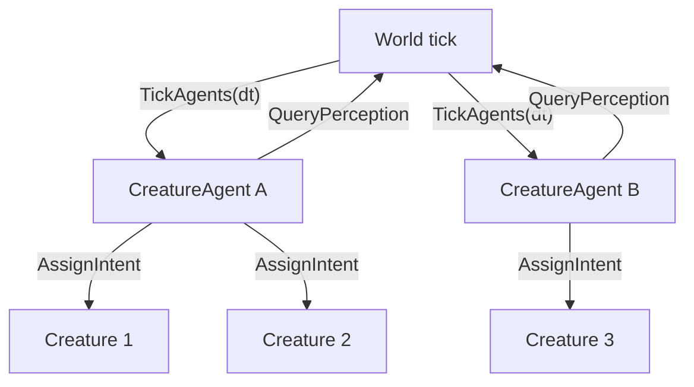

# Архитектура агентов существ (реализуется)

Документ описывает **оркестрацию активности** существ в мире Cubatarium. Базовый слой **реализован** в `src/Activity/`: директор тикает агентов, агенты пишут `CreatureIntent`, существо только **исполняет** намерение (`Creature::ExecuteIntent`).

Связанные документы: [`ARCHITECTURE.md`](ARCHITECTURE.md), [`CREATURE_CATALOG.md`](CREATURE_CATALOG.md), [`CREATURE_IMPLEMENTATION.md`](CREATURE_IMPLEMENTATION.md).

---

## Вопрос: кто «двигает» существ в мире?

| Подход | Суть | Плюсы | Минусы |
|--------|------|-------|--------|
| **Единый центр** | Один `WorldAI` / `GameDirector` знает всё и командует каждым NPC | Простая отладка, согласованность | O(N) каждый тик, узкое горло, «всезнание» |
| **Существо само** | ИИ внутри `Creature::Update()` | Локальность, понятная модель ООП | Дублирование, сложно шарить контекст мира, плохая cache locality при сотнях мобов |
| **Системы опроса (ECS)** | `PerceptionSystem` → `BehaviorTreeSystem` → `MovementSystem` по компонентам | Масштаб, разделение «мозг / исполнение» | Нужна дисциплина порядка систем; для Cubatarium пока нет ECS |
| **Агенты над группой** (ваше предложение) | Агент владеет множеством `Creature`; мир тикает агентов; агент опрашивает мир | Масштаб чанками, общий контекст на зону, слабая связь Creature↔ИИ | Доп. слой абстракции, нужны правила разбиения по агентам |

### Что рекомендуют в индустрии (кратко)

1. **Разделить решение и исполнение**  
   «Мозг» выдаёт цель (`Goal`, `Intent`), отдельные системы/контроллеры выполняют движение, атаку, анимацию ([ECS + BT](https://discussions.unity.com/t/ai-in-ecs-what-approaches-do-we-have/741984), [слои strategic/tactical/operational](https://discussions.unity.com/t/ai-in-ecs-what-approaches-do-we-have/741984)).

2. **Не класть тяжёлую логику в каждую сущность каждый кадр**  
   Когнитивный слой (BT, GOAP, utility) — реже и с хорошей локальностью данных; механика (path, collision) — каждый кадр, uniform ([ECS AI research](https://www.scribd.com/document/1014561570/ECS-AI-Execution-Architecture-Research)).

3. **Гибрид central + local**  
   Региональный координатор + автономные агенты на группу/NPC ([hierarchical multi-agent](https://www.auxiliobits.com/blog/agent-collaboration-models-centralized-vs-distributed-architectures/), [hive / regional edge](https://mygaming.cloud/designing-a-hive-mind-npc-game-dev-lessons-from-pluribus-sci)).

4. **Мир опрашивает через пространственный индекс**  
   AI Manager не знает о клиентах; сеть/рендер получают только позиции из общего индекса ([server-side AI spec](https://www.ismailguven.com/spec.php)).

5. **Избегать глобального «всезнания»**  
   Для социальных/репутационных механик — локальные belief sets, gossip O(log N), а не одна БД на весь мир ([NPC gossip 2026](https://techplustrends.com/ai-npc-gossip-protocol-social-graph-2026/)).

**Вывод для Cubatarium:** ваш вариант (агент на множество существ + мир опрашивает агентов) — это **иерархический гибрид**: не единый всемогущий центр и не полностью автономное существо с полным ИИ внутри. Хорошо стыкуется с чанковым миром (`ChunkStreamer`, регионы вокруг игрока).

---

## Предлагаемая модель (согласовано с заказчиком)

### Роли



| Модуль | Ответственность |
|--------|----------------|
| **`Creature`** | Состояние тела, bounds, инвентарь, `CreatureLocomotionController`, визуал. **Не** содержит стратегический ИИ (только применяет `Intent` / player input). |
| **`IUCreatureActivityAgent`** (напр. `WanderActivityAgent`) | Владеет списком `CreatureId` с одним `behavior` из каталога; в `Tick` строит решение и вызывает `IUCreatureActivitySink::SetIntent`. |
| **`CreatureActivityDirector`** | Реестр агентов по `behaviorId`; membership при spawn/load; **`TickAgents(perception, sink, dt)`**. |
| **`World`** | Реализует **`IUWorldPerception`**; в `DoMovement` создаёт **`WorldCreatureActivitySink`** и тикает директор **перед** `ExecuteIntent`. |
| **Управляемая сущность** | При `possess` / ввод игрока агент **не** перезаписывает intent (или агент снимает существо с своего списка на время possess). |

### Направление данных

- **Мир → агенты:** вызов `agent->Tick(perception, dt)` (pull со стороны мира, как вы описали: «мир опрашивает агентов»).
- **Агент → мир:** не прямое изменение блоков; только **запросы чтения** через `IUWorldPerception` + **запись intent** в подчинённых `Creature`.
- **Агент → существо:** `sink.SetIntent(id, intent)`; на том же кадре `Creature::ExecuteIntent` исполняет движение через **общий** [`CreatureMotor`](../src/Creatures/Locomotion/CreatureMotor.h) (тот же resolve/step-up path, что у игрока). Подробнее: [`CREATURE_MOVEMENT.md`](CREATURE_MOVEMENT.md).

### Где живёт ИИ

| Слой | Где | Частота |
|------|-----|---------|
| Стратегия (куда патрулировать, агро) | **`IUCreatureActivityAgent`** (позже pluggable `IAgentBrain`) | каждый кадр (throttle — позже) |
| Тактика (обход препятствия, выбор скорости) | Агент или общий `LocomotionHelper` | 10–20 Гц |
| Исполнение (коллизии, гравитация, facts, derive state) | **`Creature` + shared `CreatureMotor` + `World`** | каждый кадр |
| Presentation (поза частей, walk cycle) | **`src/Pose/*` + `IUCreatureVisual`** | каждый кадр (render) |

ИИ **не** внутри `Creature` как монолит; **мозг** — у агента (или у plug-in мозга агента). Существо — **исполнитель** намерений + особый случай **player input** для controlled.

### Разбиение по агентам

Рекомендуемые правила (для будущей реализации):

1. **По чанку / региону** — агент на набор чанков в радиусе стриминга; все мобы в регионе у одного агента.
2. **По типу** — `AmbientAgent`, `HostileAgent` (разные `IAgentBrain`).
3. **Лимит существ на агент** — например 16–64, при переполнении создать второго агента в том же регионе.

`Player` может не иметь агента (только input), либо «пустой» агент-заглушка для единообразия API.

---

## Реализованные интерфейсы

| Тип | Файл | Назначение |
|-----|------|------------|
| `CreatureActivityTypes` | `CreatureActivityTypes.h` | `CreatureId`, `CreatureActivityView`, `ControlledCreatureInfo` |
| `IUWorldPerception` | `IUWorldPerception.h` | `QueryControlledCreatureInfo()`, `CreaturesInRadius()` |
| `IUCreatureActivitySink` | `IUCreatureActivitySink.h` | `GetCreatureView`, `GetBehaviorSnapshot`, `SetIntent` |
| `IUCreatureActivityAgent` | `IUCreatureActivityAgent.h` | `GetBehaviorId()`, membership, `Tick` |
| `CreatureActivityDirector` | `CreatureActivityDirector.*` | Реестр агентов, `OnCreatureAdded/Removed`, `TickAgents` |
| `WorldCreatureActivitySink` | `WorldCreatureActivitySink.*` | Адаптер к `World` / `Creature` |
| `RegisterDefaultCreatureActivityAgents` | `CreatureActivityRegistry.*` | Регистрация `WanderActivityAgent` для `behavior: wander` |
| `WanderActivityAgent` | `agents/WanderActivityAgent.*` | Случайное блуждание; состояние таймера в агенте |
| `TerrestrialBipedPosePresenter` | `src/Pose/*` | Процедурная анимация по `CreatureLocomotionFacts` (не в агенте) |

`CreatureIntent` и `SetIntent` на существе уже есть; исполнение — **`Creature::ExecuteIntent`**.

### Порядок `World::DoMovement`

1. Стриминг коллизий вокруг controlled (если включён).
2. `WorldCreatureActivitySink activitySink(*this);`
3. `activityDirector_.TickAgents(*this, activitySink, dt);` — агенты выставляют intent.
4. `ForEachCreature` → `ExecuteIntent` для всех, **кроме** controlled id и **possessed**.
5. `Camera::DoMovement` — ввод игрока, синхронизация controlled с камерой.
6. Коллизии / привязка ног / прочая физика мира (как раньше).

Controlled и possessed **не** получают intent от агентов в шаге 4; игрок двигается через камеру.

### Membership при spawn

`World::SpawnCreature` / загрузка `creatures.json` вызывает `activityDirector_.OnCreatureAdded(id, behaviorId)` из `creature.json`. Значение `none` или пустое — **без** агента. `wander` — попадает в `WanderActivityAgent`.

---

## Файлы `src/Activity/`

```
src/Activity/
  CreatureActivityTypes.h
  IUCreatureActivitySink.h
  IUWorldPerception.h
  IUCreatureActivityAgent.h
  CreatureActivityDirector.h
  CreatureActivityDirector.cpp
  WorldCreatureActivitySink.h
  WorldCreatureActivitySink.cpp
  CreatureActivityRegistry.h
  CreatureActivityRegistry.cpp
  agents/
    WanderActivityAgent.h
    WanderActivityAgent.cpp
```

---

## Этапы внедрения (дальше)

1. ~~`CreatureIntent` + `ExecuteIntent`~~ — сделано.
2. ~~`CreatureActivityDirector` + `WanderActivityAgent`~~ — сделано.
3. ~~`IUWorldPerception` (controlled + существа в радиусе)~~ — сделано.
4. Региональные агенты по чанкам; лимит существ на агент.
5. `SampleBlocks` в `IUWorldPerception`; pluggable `IAgentBrain`; throttle `Tick`.
6. Долгосрочно: локальные belief / gossip.

---

## Steering / mob separation (фаза 0)

Общая тактика для activity-агентов: [`CreatureActivitySteering`](../../src/Activity/Helpers/CreatureActivitySteering.h).

| API perception | Назначение |
|----------------|------------|
| `CreaturesClearAt` | Probe без пересечения AABB других существ (не blocks) |
| `QueryCreatureNeighborsInRadius` | Соседи с `bodyOrigin` для separation |
| `GetCreatureBodyOrigin` | Позиция по `CreatureId` |

`WanderActivityAgent` использует:

- `PickLocomotionDirection` — habitat + creature probe
- `ComputeSeparationDirection` / `BlendLocomotionDirection` — разъезд в толпе
- `IsLocomotionStuck` — repick направления при залипании
- `TryDepenetrateSpawnOrigin` (spawn/load) — XZ-сдвиг при overlap в [`CreatureEnvironment`](../../src/Creatures/Environment/CreatureEnvironment.cpp)

## Navigation (фаза 1)

Модуль [`src/Navigation/`](../src/Navigation/): `UNavigationPathfinder` (A* по stand-nodes), `UWaypointFollower`, `SteerCreatureAlongPath` в [`CreatureActivityNavigation`](../../src/Activity/Helpers/CreatureActivityNavigation.h).

**Важно:** цель A* для chase/flee — `ControlledCreatureInfo.bodyOrigin` (feet), не `eyePosition` (после feet-anchored collision eye не является stand-node).

## Diagnostics

`UCreatureMovementDiagnostics` (`creature_movement_diag.v1`): console `creature_diag`, config `gameplay.creature_movement_diag`. См. [`CREATURE_MOVEMENT.md`](CREATURE_MOVEMENT.md).

## Масштаб (фаза 2)

- [`CreatureSpatialIndex`](../../src/World/Environment/CreatureSpatialIndex.cpp) — инкрементальный `Upsert`/`Remove`/`PruneExcept`; `SyncCreatureSpatialIndex` перед `TickActivity` обновляет только сдвинувшихся мобов
- Throttle когнитивного слоя: `gameplay.activity_tick_hz` в `config.json` → `UCreatureActivityDirector::SetActivityTickInterval` (default 20 Гц)
- `IsWithinActivityRange` — моб тикается только если его ground-chunk в активном кольце `UChunkStreamer` (тот же критерий, что `ShouldKeepChunkLoaded`)

## Brain + новые behaviors (фаза 3)

- [`IUAgentBrain`](../../src/Activity/Brain/IUAgentBrain.h), [`USimpleFsmBrain`](../../src/Activity/Brain/SimpleFsmBrain.cpp)
- `flee` → [`FleeActivityAgent`](../../src/Activity/Agents/FleeActivityAgent.cpp) (sheep); steering фазы 0 (separation + `PickLocomotionDirection`) в flee-ветке brain
- `melee_attack` → [`MeleeAttackActivityAgent`](../../src/Activity/Agents/MeleeAttackActivityAgent.cpp) (zombie, skeleton, dungeon_master)
- `bot_player` → [`BotPlayerActivityAgent`](../../src/Activity/Agents/BotPlayerActivityAgent.cpp) (species `bot`): follow player, chase/attack hostiles via `attackTargetId`
- `CreatureIntent.attackTargetId` → [`CreatureCombat::TryMeleeStrike`](../../src/Creatures/Combat/CreatureCombat.cpp) (Survival); perception масштабирует `aggro_radius`
- Stats / modes: [`CREATURE_STATS.md`](CREATURE_STATS.md)

---

## Альтернативы, если агенты окажутся избыточны

- **Только ECS-системы** без класса Agent: `WanderSystem` обрабатывает все существа с тегом `MobTag` — по сути один агент на весь мир.
- **Полностью в существе** — приемлемо при &lt; 20 мобах; при росте перенести мозг в агента без смены `Creature` API (вынести код из `Update` в `AgentBrain`).

---

## Резюме

- **Лучшая практика:** мозг отдельно от исполнения; мир/директор тикает обработчики; пространственная локальность; гибрид региональных координаторов.
- **Сейчас в коде:** один глобальный `WanderActivityAgent` на всех мобов с `behavior: wander`; wander-состояние **не** в `Creature`.
- **Этот файл** — источник истины для расширения агентов; каталог поведений — [`CREATURE_CATALOG.md`](CREATURE_CATALOG.md).
