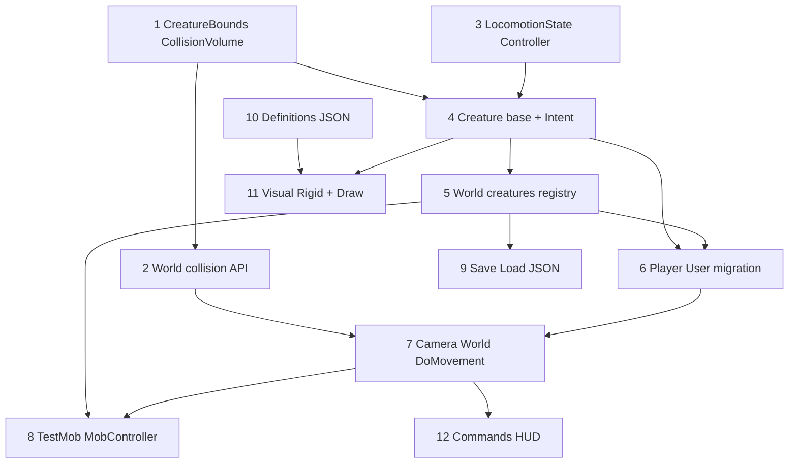

# Creature — детальный план реализации (для агентов)

Источник требований: `.cursor/plans/интеграция_creature_*.plan.md`, [`CREATURE_AGENTS.md`](CREATURE_AGENTS.md) (фаза агентов **после** B).

> **Каталог species/skins (ship set 4+5):** [CREATURE_CATALOG.md](CREATURE_CATALOG.md) — JSON, палитра, команды, smoke.

**Принципы:**

1. Каждый шаг — компилируемый кусок; не переходить дальше, пока не пройден checkpoint.
2. **После каждого шага — git commit на английском** (см. §0.1).

---

## 0.1 Git workflow (mandatory for implementing agents)

### When to commit

| Event | Action |
|-------|--------|
| Checkpoint §N passed + build OK | **Commit immediately** before starting §N+1 |
| Build broken | Do **not** commit; fix or revert |
| WIP mid-step | Do **not** commit half-step |
| User asked not to commit | Skip commits until told otherwise |

### What to stage

**Include:** `src/**`, `models/creatures/**`, `CMakeLists.txt`, `docs/CREATURE_*.md` touched in this step.

**Exclude:**

- `bin/linkerrors.txt`, `bin/*.exe`, object files
- Local `config.json` / worlds saves unless step explicitly tests saves (step 9 may only touch code paths, not commit `worlds/`)
- `.cursor/plans/` (optional; prefer not unless user wants plan in repo)

### Commit message table (English)

Use exactly these **first lines** (imperative, conventional commits):

| Step | `git commit -m "..."` |
|------|------------------------|
| 1 | `feat(creature): add CreatureBounds and CollisionVolume helpers` |
| 2 | `refactor(creature): generalize World collision to CollisionVolume` |
| 3 | `feat(creature): add CreatureLocomotionController with shared flight mode` |
| 4 | `feat(creature): add Creature base class and CreatureIntent` |
| 5 | `feat(creature): add World creature registry and spawn API` |
| 6 | `feat(creature): add Player, CreatureInventory, and User migration` |
| 7 | `feat(creature): wire Camera and DoMovement to controlled creature` |
| 8 | `feat(creature): add TestMob, MobController, and possess` |
| 9 | `feat(creature): persist creatures.json and extend users.json` |
| 10 | `feat(creature): load creature definitions from models/creatures` |
| 11 | `feat(creature): add rigid voxel visual and glTF backend stub` |
| 12 | `feat(creature): add creature console commands and HUD inventory` |

Optional body (second paragraph via `-m` twice or editor):

```
Step N of Creature iteration B. Build verified.
```

### Agent checklist (copy per step)

```
[ ] Build succeeded
[ ] Checkpoint §N items checked
[ ] git status — only expected paths
[ ] git add <paths>
[ ] git commit -m "feat(creature): ..."
[ ] git log -1 --oneline  (verify)
```

### Multi-file add hint per step

| Step | Typical `git add` paths |
|------|-------------------------|
| 1 | `src/CreatureBounds.*` `src/CollisionVolume.h` |
| 2 | `src/World.*` `src/ChunkStreamer.*` |
| 3 | `src/LocomotionTypes.h` `src/CreatureLocomotionController.*` `src/PlayerController.*` |
| 4 | `src/Creature.*` `src/CreatureIntent.h` |
| 5 | `src/World.h` `src/World.cpp` (registry part) |
| 6 | `src/Player.*` `src/CreatureInventory.*` `src/User.*` |
| 7 | `src/Camera.*` `src/World.cpp` (`DoMovement`) |
| 8 | `src/TestMob.*` `src/MobController.*` |
| 9 | `src/World.cpp` (Load/Save) |
| 10 | `src/CreatureDefinition*` `models/creatures/*.json` `src/Core.cpp` |
| 11 | `src/CreatureVisual*` `src/GeometryEngine.cpp` `CMakeLists.txt` |
| 12 | `src/Game/GameSession.cpp` `src/GeometryEngine.cpp` |

### Do not

- `git push` unless user requests
- `git commit --amend` unless hook auto-fixed files and user rules allow
- Combine steps 3+4 in one commit
- Empty commit

---

## 0. Карта зависимостей



| Шаг | Файлы (новые) | Файлы (правки) | Checkpoint |
|-----|---------------|----------------|------------|
| 1 | `CreatureBounds.h`, `CollisionVolume.h` | — | unit: halfExtents, eye, center; **commit** |
| 2 | — | `World.h/cpp`, `ChunkStreamer.h/cpp` | игра: присед без регрессии через adapter |
| 3 | `LocomotionTypes.h`, `CreatureLocomotionController.*` | `PlayerController.*` → thin alias или delete | compile; fly toggle |
| 4 | `CreatureIntent.h`, `Creature.h/cpp` | — | spawn dummy creature in test |
| 5 | — | `World.h/cpp` | `creatures_` map, ids |
| 6 | `Player.*`, `CreatureInventory.*`, `TestMob.*` | `User.*`, `World::AddUser` | load user → player creature |
| 7 | — | `Camera.*`, `World::DoMovement` | walk + crouch + fly |
| 8 | `MobController.*` | `TestMob` | mob wanders |
| 9 | — | `World::Load/Save`, `users.json` | reload world |
| 10 | `CreatureDefinition*`, JSON | `Core::LoadSystem` | defs loaded |
| 11 | `CreatureVisual*` | `GeometryEngine`, `CMakeLists` | see mob mesh |
| 12 | — | `GameSession`, `GeometryEngine` HUD | console commands |

---

## 1. Типы и константы (шаг 1)

### 1.1 `src/CollisionVolume.h`

```cpp
namespace cutum {
struct CollisionVolume {
  glm::vec3 center{0};
  glm::vec3 halfExtents{0.5f}; // half-size per axis
};
}
```

### 1.2 `src/CreatureBounds.h`

```cpp
struct CreatureBoundsProfile {
  glm::vec3 restSizeBlocks{0.6f, 1.8f, 0.6f};  // width, height, depth
  glm::vec3 maxSizeBlocks{0.6f, 1.8f, 0.6f};
  glm::vec3 minSizeBlocks{0.6f, 1.5f, 0.6f};
};

struct CreatureBoundsState {
  CreatureBoundsProfile profile;
  glm::vec3 currentSizeBlocks;
  float stanceBlend01{0.f}; // 0=rest, 1=min (crouch)
};

// Pure functions (no World):
glm::vec3 BoundsHalfExtents(const glm::vec3& sizeBlocks);
glm::vec3 BoundsCollisionCenter(const glm::vec3& bodyOrigin,
                                const glm::vec3& currentSizeBlocks);
float BoundsFeetY(const glm::vec3& bodyOrigin);
glm::vec3 BoundsEyePosition(const glm::vec3& bodyOrigin, const glm::vec3& eyeOffset);
CreatureBoundsState LerpBoundsStance(const CreatureBoundsState& s, float blend01);
```

**Миграция с `PlayerCapsule`:**

| PlayerCapsule | CreatureBoundsProfile (player) |
|---------------|-------------------------------|
| height 1.8 | restSizeBlocks.y = 1.8 |
| halfWidth 0.3 | rest.x/z = 0.6 |
| crouch height 1.5 | minSizeBlocks.y = 1.5 |
| eyeHeight 1.62 | eyeOffset.y = 1.62 (от bodyOrigin) |

`bodyOrigin.y` = feet level; `eye = bodyOrigin + (0, 1.62, 0)`.

### 1.3 Checkpoint 1

- [ ] Добавить `src/CreatureBounds.cpp` с тестами вручную: `LerpBoundsStance(0)==rest`, `Lerp(1)==min`.
- [ ] **Commit:** `feat(creature): add CreatureBounds and CollisionVolume helpers`

---

## 2. World collision API (шаг 2)

### 2.1 Новые сигнатуры в `World.h`

```cpp
bool CheckCollisionVolume(const CollisionVolume& vol) const;
bool HasGroundSupportVolume(const CollisionVolume& vol, float feetY) const;
glm::vec3 ResolveMovementBody(const glm::vec3& bodyOrigin, const glm::vec3& delta,
                              const CollisionVolume& vol) const;
```

### 2.2 Рефактор `World.cpp`

1. Выделить тело `CheckCollision(eye, cap)` → построить `CollisionVolume` через helper `CollisionVolumeFromCapsule(eye, cap)` (временный adapter).
2. Переписать `CheckCollision` как `return CheckCollisionVolume(CollisionVolumeFromCapsule(...))`.
3. `ResolveMovement(eye, delta, cap)`:
   - `body = eye - eyeOffset` (пока фиксированный player offset);
   - `vol = volume from cap at body`;
   - `newBody = ResolveMovementBody(body, delta, vol)`;
   - `return newBody + eyeOffset`.
4. `HasGroundSupport`, `TryStepUp`, `ProbeStepUp`, `SampleFluidPhysics` — принять `CollisionVolume` + `feetY` или builder `CreatureCollisionBuilder`.

### 2.3 `ChunkStreamer`

- Заменить `PlayerCapsule` в `Update` / `EnsureCollisionChunks` на:

```cpp
struct StreamCollisionContext {
  glm::vec3 bodyOrigin;
  CollisionVolume volume;
};
```

Пока строить из camera + adapter capsule.

### 2.4 Checkpoint 2

- [ ] Сборка OK.
- [ ] В игре: ходьба, присед, step-up без изменения поведения.
- [ ] **Commit:** `refactor(creature): generalize World collision to CollisionVolume`

---

## 3. Locomotion (шаг 3)

### 3.1 `src/LocomotionTypes.h`

```cpp
enum class CreatureMovementMode { Walking, Flying };
enum class LocomotionState {
  Idle, Walk, Run, Jump, Fall, Crouch, Fly
};

struct CreatureInput {
  bool moveForward, moveBack, moveLeft, moveRight;
  bool jumpHeld, jumpPressed, crouchHeld;
};

struct CreatureLocomotionCapabilities {
  bool canFly{true};
  bool canCrouch{true};
  bool canJump{true};
};
```

### 3.2 `CreatureLocomotionController`

Перенести из [`PlayerController.cpp`](../src/PlayerController.cpp) почти 1:1:

| Было | Стало |
|------|-------|
| `PlayerMovementMode` | `CreatureMovementMode` |
| `PlayerInput` | `CreatureInput` |
| `PlayerCapsule GetCapsule()` | `void UpdateBoundsState(CreatureBoundsState& bounds)` |
| `UpdateLocomotion(World, eyePos, ...)` | `UpdateLocomotion(World, glm::vec3& bodyOrigin, glm::vec3 eyeOffset, ...)` |

**Важно:** внутри контроллера хранить `feetY_`, `stanceBlend_` от **bodyOrigin**, не от eye.

Публичные методы:

```cpp
void Reset();
CreatureMovementMode GetMode() const;
float GetStanceBlend() const;
LocomotionState GetLocomotionState() const; // NEW: derive from velocity/keys/mode
bool OnSpacePressed(); // double-tap fly
void UpdateLocomotion(const World* world, glm::vec3& bodyOrigin,
                      const glm::vec3& eyeOffset, const CreatureInput& input,
                      float dt, CreatureBoundsState& bounds,
                      const CreatureLocomotionCapabilities& caps);
```

`GetLocomotionState()` правила (итерация B):

- `Flying` mode → `LocomotionState::Fly`
- `stanceBlend > 0.05` → `Crouch`
- horizontal speed > 0.1 && on ground → `Walk`
- `!onGround` && vy < 0 → `Fall`
- else → `Idle`

### 3.3 `PlayerController`

- Вариант A: `using PlayerController = CreatureLocomotionController;` + typedef input.
- Вариант B: оставить файл-обёртку `#include CreatureLocomotionController` (меньше diff в Camera).

### 3.4 Checkpoint 3

- [ ] Camera всё ещё компилируется с контроллером.
- [ ] `fly` / double Space работают на игроке.
- [ ] **Commit:** `feat(creature): add CreatureLocomotionController with shared flight mode`

---

## 4. Creature + Intent (шаг 4)

### 4.1 `src/CreatureIntent.h`

```cpp
struct CreatureIntent {
  glm::vec3 moveDirWorld{0}; // normalized; zero = no AI move
  float moveSpeed{0};
  bool wantJump{false};
  bool clearOnApply{true};
  LocomotionState suggestedAnim{LocomotionState::Idle};
};
```

### 4.2 `src/Creature.h`

```cpp
using CreatureId = uint64_t;

class Creature {
public:
  CreatureId GetId() const;
  const std::string& GetTypeId() const;
  glm::vec3 GetBodyOrigin() const;
  void SetBodyOrigin(glm::vec3);
  glm::vec3 GetEyeOffset() const;
  glm::vec3 GetEyePosition() const;
  float GetYaw() const; float GetPitch() const;
  void SetOrientation(float yaw, float pitch);
  const CreatureBoundsState& GetBounds() const;
  CreatureBoundsState& GetBoundsMutable();
  CollisionVolume GetCollisionVolume() const;
  CreatureLocomotionController& GetLocomotion();
  CreatureInventory& GetInventory();
  CreatureIntent GetIntent() const;
  void SetIntent(CreatureIntent);
  void ClearIntent();
  LocomotionState GetLocomotionState() const;
  bool IsPlayerCharacter() const;
  bool IsPossessed() const; // set by World
  virtual void ApplyIntent(World& world, float dt); // default: AI wander → locomotion
  virtual void UpdateControlled(World& world, const CreatureInput& input, float dt);
protected:
  CreatureId id_;
  std::string typeId_;
  glm::vec3 bodyOrigin_;
  glm::vec3 eyeOffset_;
  CreatureBoundsState bounds_;
  CreatureLocomotionController locomotion_;
  CreatureInventory inventory_;
  CreatureIntent intent_{};
  CreatureLocomotionCapabilities caps_;
  bool playerCharacter_{false};
};
```

`GetCollisionVolume()`:

```cpp
return { BoundsCollisionCenter(bodyOrigin_, bounds_.currentSizeBlocks),
         BoundsHalfExtents(bounds_.currentSizeBlocks) };
```

### 4.3 Checkpoint 4

- [ ] Создать `Creature` в тестовом main или временном коде — не линковать в World.
- [ ] **Commit:** `feat(creature): add Creature base class and CreatureIntent`

---

## 5. Реестр в World (шаг 5)

### 5.1 Поля `World.h`

```cpp
std::unordered_map<CreatureId, std::unique_ptr<Creature>> creatures_;
CreatureId nextCreatureId_{1};
CreatureId playerCreatureId_{0};      // creature of CurrentUser's Player
CreatureId controlledCreatureId_{0};  // possess target or playerCreatureId
std::shared_ptr<CreatureDefinitionStorage> creatureDefinitions_; // step 10
```

### 5.2 API

```cpp
Creature* GetCreature(CreatureId id);
Creature* GetControlledCreature();
Creature* GetPlayerCreatureForUser(const std::string& userName);
bool SetControlledCreature(CreatureId id); // validates exist, not dead
CreatureId SpawnCreature(const std::string& typeId, glm::vec3 bodyOrigin);
void RemoveCreature(CreatureId id);
void ForEachCreature(std::function<void(Creature&)> fn);
const CreatureDefinition* GetCreatureDefinition(const std::string& typeId) const;
std::string ResolveAnimationTypeId(const Creature& c) const; // appearance rules
```

`ResolveAnimationTypeId`:

```cpp
if (controlled == &c) return c.GetTypeId();
if (c.IsPlayerCharacter()) {
  if (auto u = GetCurrentUser())
    if (!u->GetSelectedAppearanceTypeId().empty())
      return u->GetSelectedAppearanceTypeId();
}
return c.GetTypeId();
```

### 5.3 Checkpoint 5

- [ ] `SpawnCreature` в `World::Create` не вызывать пока — только API.
- [ ] **Commit:** `feat(creature): add World creature registry and spawn API`

---

## 6. Player, User, Inventory (шаг 6)

### 6.1 `CreatureInventory.h`

Перенести из [`User.h`](../src/User.h):

- `std::map<std::string,int> storage`
- `std::vector<HotbarBar> hotbars_`
- `activeBarIndex_`, `activeSlotIndex_`
- методы: `GetInventory`, `AssignToHotbar`, `Serialize`/`Deserialize` (nlohmann)

### 6.2 `Player.h`

```cpp
class Player : public Creature {
public:
  Player(CreatureId id, glm::vec3 bodyOrigin);
  void BindUser(const std::shared_ptr<User>& user);
  std::shared_ptr<User> GetUser() const;
  bool IsPlayerCharacter() const override { return true; }
};
```

### 6.3 `User.h` изменения

**Убрать:** `Position`, hotbars, inventory map (перенесены).

**Добавить:**

```cpp
CreatureId GetPlayerCreatureId() const;
void SetPlayerCreatureId(CreatureId id);
const std::string& GetSelectedAppearanceTypeId() const;
void SetSelectedAppearanceTypeId(const std::string& typeId);
```

**Оставить:** `ViewId`, `CameraYaw/Pitch` (кэш до sync), hotbar UI может читать через `world->GetControlledCreature()->GetInventory()`.

### 6.4 `World::AddUser` (новый поток)

```
1. Users[name] = make_shared<User>()
2. def = creatureDefinitions_->Get("player") or defaults
3. bodyOrigin = SpawnPoint - vec3(0, def.eye_height, 0)
4. player = make_unique<Player>(nextId++, bodyOrigin)
5. player->SetTypeId("player"); init bounds from def
6. creatures_[id] = move(player)
7. user->SetPlayerCreatureId(id)
8. controlledCreatureId_ = id (if first user)
9. camera = make_shared<Camera>() // position temporary
10. ViewInstance->AddCameraReturnId(camera)
11. user->SetViewId(viewId)
```

### 6.5 Checkpoint 6

- [ ] Новый мир: пользователь создаётся, creature id записан.
- [ ] Старый `users.json` грузится: `position` (eye) → `bodyOrigin = eye - (0,1.62,0)`.
- [ ] **Commit:** `feat(creature): add Player, CreatureInventory, and User migration`

---

## 7. Camera + DoMovement (шаг 7)

### 7.1 Разделение ролей Camera

| Данные | Владелец после рефактора |
|--------|-------------------------|
| yaw, pitch, fov | `Camera` |
| bodyOrigin, bounds, locomotion | `Creature` (controlled) |
| eye world pos | `creature->GetEyePosition()` |

`Camera::GetPosition()` → делегат `World::GetControlledCreature()->GetEyePosition()` (через указатель `World*` или callback).

Минимальный diff итерации B:

- `Camera` хранит `CreatureId controlledId_` (0 = legacy eye-only mode).
- `DoMovement` после locomotion: `camera->SetPosition(creature->GetEyePosition())`.

### 7.2 `World::DoMovement` — псевдокод

```cpp
void World::DoMovement() {
  if (!blockWorldReady_) return;
  float dt = getDeltaFromCamera();
  Creature* ctrl = GetControlledCreature();
  if (!ctrl) return;

  // Streaming под ноги controlled
  CollisionVolume vol = ctrl->GetCollisionVolume();
  streamer_->EnsureCollisionChunks(feetBlock(vol));

  // 1) Non-controlled creatures: AI / intent
  for (auto& [id, c] : creatures_) {
    if (id == controlledCreatureId_) continue;
    if (c->IsPossessed()) continue; // safety
    c->ApplyIntent(*this, dt);      // MobController → SetIntent internally
  }

  // 2) Controlled: input from Camera keys
  CreatureInput input = BuildInputFromCamera(GetCurrentUserCamera());
  ctrl->UpdateControlled(*this, input, dt);

  // 3) Sync camera + user cache
  if (auto cam = GetCurrentUserCamera()) {
    cam->SetPosition(ctrl->GetEyePosition());
    cam->SetOrientation(ctrl->GetYaw(), ctrl->GetPitch());
  }
  if (auto u = GetCurrentUser())
    if (auto p = GetPlayerCreatureForUser(u))
      if (ctrl->GetId() == p->GetId()) { /* save eye in user optional */ }

  UpdateStreaming();
  UpdateIntersection(ctrl->GetEyePosition(), front);
}
```

### 7.3 `Creature::UpdateControlled`

```cpp
void Creature::UpdateControlled(World& world, const CreatureInput& input, float dt) {
  ClearIntent(); // player input overrides AI
  glm::vec3 body = bodyOrigin_;
  locomotion_.UpdateLocomotion(&world, body, eyeOffset_, input, dt, bounds_, caps_);
  bodyOrigin_ = body;
  // horizontal move: read Camera shift intent — see 7.4
}
```

### 7.4 Горизонтальное движение

Сейчас в [`Camera::ApplyHorizontalMovement`](../src/Camera.cpp). Перенос:

- `Camera::DoMovement(world)` собирает `CreatureInput` + вызывает `world->TickControlledCreature(input)` **или**
- `Camera` оставляет horizontal shift, но `ResolveMovement` принимает `bodyOrigin` + volume от creature.

**Рекомендуемый порядок для агента:**

1. Передать `Creature*` в `Camera::DoMovement(const World*, Creature* controlled)`.
2. Внутри — существующий shift code, заменить `GetPlayerCapsule()` на `controlled->GetCollisionVolume()` и eye/body convert.
3. `SetFreeMove` ↔ `locomotion_.SetMode(Flying)` на **controlled** creature.

### 7.5 Checkpoint 7

- [ ] Полный цикл игрока без моба.
- [ ] `tp` обновляет `bodyOrigin` (команда: eye given → subtract eyeOffset).
- [ ] **Commit:** `feat(creature): wire Camera and DoMovement to controlled creature`

---

## 8. TestMob + MobController (шаг 8)

### 8.1 `MobController.h`

```cpp
// TEMP: replace with CreatureAgent per CREATURE_AGENTS.md
class MobController {
public:
  void Tick(World& world, Creature& self, float dt);
private:
  float wanderTimer_{0};
  glm::vec3 wanderDir_{1,0,0};
};
```

`Tick`: каждые 2–4 сек новый random XZ dir; `SetIntent({moveDir, speed=2, suggestedAnim=Walk})`.

### 8.2 `TestMob`

```cpp
class TestMob : public Creature {
  MobController ai_;
public:
  void ApplyIntent(World& w, float dt) override {
    if (IsPossessed()) return;
    ai_.Tick(w, *this, dt);
    Creature::ApplyIntent(w, dt); // applies intent → body motion
  }
};
```

### 8.3 `Creature::ApplyIntent` (базовый)

```cpp
void Creature::ApplyIntent(World& world, float dt) {
  if (intent_.moveDirWorld == glm::vec3(0)) return;
  glm::vec3 delta = intent_.moveDirWorld * intent_.moveSpeed * dt;
  delta.y = 0; // gravity handled in locomotion for mobs — simplify: use locomotion idle + horizontal ResolveMovementBody
  bodyOrigin_ = world.ResolveMovementBody(bodyOrigin_, delta, GetCollisionVolume());
  if (intent_.clearOnApply) ClearIntent();
}
```

Для мобов без прыжка: отдельный `MobLocomotion` упрощение — гравитация: copy `syncGroundedPose` из контроллера в `ApplyIntent` после horizontal.

### 8.4 Possess

`World::SetControlledCreature(id)`:

- `controlledCreatureId_ = id`
- `creatures_[id]->SetPossessed(true)` (флаг)
- AI skip via `IsPossessed()`

`Depossess`: вернуть `playerCreatureId_`, clear possessed flags.

### 8.5 Checkpoint 8

- [ ] `spawn_test_mob` в 2м от spawn.
- [ ] Моб блуждает; possess → WASD; depossess → снова блуждает.
- [ ] **Commit:** `feat(creature): add TestMob, MobController, and possess`

---

## 9. Save / Load (шаг 9)

### 9.1 `creatures.json` schema v1

```json
{
  "format_version": 1,
  "creatures": [
    {
      "id": 2,
      "type": "test_mob",
      "body_origin": [1.0, 64.0, 3.0],
      "yaw": -90.0,
      "pitch": 0.0,
      "movement_mode": "walking",
      "stance_blend": 0.0,
      "inventory": { "dirt": 1 },
      "hotbars": []
    }
  ]
}
```

### 9.2 `users.json` additions

```json
{
  "name": "Username",
  "player_creature_id": 1,
  "selected_appearance_type": "test_mob",
  "position": [0, 70, 0],
  "yaw": -90,
  "pitch": 0
}
```

- `position` при **загрузке**: eye (legacy) → convert to `body_origin` on player creature.
- При **сохранении**: писать eye = `GetEyePosition()` для совместимости.

### 9.3 `World::Load` порядок

```
LoadWorldData
LoadUsers        // creates users only if missing creatures — see migration
LoadCreatures    // NEW: creatures.json
if no player creature for user → create Player in AddUser flow
FinalizePlayerAfterWorldLoad → sync controlled + camera
```

### 9.4 Checkpoint 9

- [ ] save → reload → mob на месте, player позиция OK.
- [ ] **Commit:** `feat(creature): persist creatures.json and extend users.json`

---

## 10. Definitions (шаг 10)

### 10.1 Файлы

- [`models/creatures/player.json`](../models/creatures/player.json)
- [`models/creatures/test_mob.json`](../models/creatures/test_mob.json)

### 10.2 `CreatureDefinition`

```cpp
struct CreatureDefinition {
  std::string id;
  CreatureBoundsProfile bounds;
  float eyeHeight{1.62f};
  CreatureLocomotionCapabilities locomotion;
  std::string visualBackend; // "rigid_voxels" | "gltf_skeleton"
  // parts, animations map string -> ClipDef
};
```

### 10.3 `CreatureDefinitionStorage`

По образцу [`BlockDefinitionStorage`](../src/BlockDefinitionStorage.cpp):

- `Load(folder)` читает все `*.json`
- `Get(id) -> const CreatureDefinition*`

### 10.4 `Core::LoadSystem`

После block definitions: `creatureDefinitions_->Load(root + "/models/creatures")`.

CMake: копия `models/` уже включает подпапку `creatures/`.

### 10.5 Checkpoint 10

- [ ] Лог при старте: `Loaded N creature definitions`.
- [ ] **Commit:** `feat(creature): load creature definitions from models/creatures`

---

## 11. Visual Rigid + D stub (шаг 11)

### 11.1 Новые файлы

| Файл | Назначение |
|------|------------|
| `CreatureVisual.h` | `IUCreatureVisual` |
| `CreatureVisualFactory.cpp` | по `visual.backend` |
| `CreatureVisualRigid.cpp` | parts + pose |
| `CreatureVisualGltf.cpp` | stub `SubmitDraw` empty |

### 11.2 `IUCreatureVisual`

```cpp
class IUCreatureVisual {
public:
  virtual ~IUCreatureVisual() = default;
  virtual void UpdatePose(const Creature&, LocomotionState,
                          const CreatureDefinition& animDef, float dt) = 0;
  virtual void SubmitDraw(GeometryEngine&, const glm::mat4& viewProj) = 0;
};
```

Фабрика при spawn: `CreatureVisualFactory::Create(def.visualBackend, def)`.

### 11.3 Draw pass

В [`GeometryEngine::Paint`](../src/GeometryEngine.cpp) после opaque world:

```
world->ForEachCreature([&](Creature& c) {
  if (c.IsPlayerCharacter() && !thirdPerson) return; // FP: no self body
  if (auto* vis = c.GetVisual()) vis->SubmitDraw(*this, viewProj);
});
```

Итерация B: **всегда рисовать мобов**; игрок с `selectedAppearance` — опционально 3rd person stub (config `gameplay.show_player_body`).

### 11.4 Animations minimal

`test_mob`: `idle` head rotate 0; `walk` head sway ±10°; `fly` body pitch 10°.

`player` type: другие углы (чтобы отличать при `select_appearance`).

### 11.5 Debug AABB

`config.json`: `"render": { "creature_debug_bounds": false }` — wireframe `current` и `max` size.

### 11.6 Checkpoint 11

- [ ] Видны части test_mob при walk.
- [ ] `select_appearance test_mob` меняет позу игрока (если show body) или только state log.
- [ ] **Commit:** `feat(creature): add rigid voxel visual and glTF backend stub`

---

## 12. Commands + HUD (шаг 12)

### 12.1 `GameSession::RegisterCommands`

| Команда | Действие |
|---------|----------|
| `spawn_test_mob` | `world->SpawnCreature("test_mob", spawn + offset)` |
| `possess [id]` | без id → первый non-player creature |
| `depossess` | `SetControlledCreature(playerCreatureId)` |
| `select_appearance <type>` | `user->SetSelectedAppearanceTypeId(type)` |
| `fly [on\|off]` | `GetControlledCreature()->GetLocomotion().SetMode(...)` |
| `tp x y z` | eye pos → set bodyOrigin = eye - eyeOffset |

Обновить `help` string.

### 12.2 HUD / hotbar

Файлы: [`GameSession.cpp`](../src/Game/GameSession.cpp), [`GeometryEngine.cpp`](../src/GeometryEngine.cpp).

Заменить `world_->GetCurrentUser()` inventory на:

```cpp
auto* c = world_->GetControlledCreature();
if (c) c->GetInventory();
```

### 12.3 Checkpoint 12 — финальная приёмка

- [ ] Все пункты чеклиста в plan file.
- [ ] **Commit:** `feat(creature): add creature console commands and HUD inventory`

---

## 13. CMake

Добавить в `SOURCES`:

```
src/CreatureBounds.cpp
src/CreatureLocomotionController.cpp
src/Creature.cpp
src/CreatureInventory.cpp
src/Player.cpp
src/TestMob.cpp
src/MobController.cpp
src/CreatureDefinition.cpp
src/CreatureDefinitionStorage.cpp
src/CreatureVisualFactory.cpp
src/CreatureVisualRigid.cpp
src/CreatureVisualGltf.cpp
```

`PlayerCapsule.h` — оставить до полного удаления adapter; затем удалить.

---

## 14. Порядок работы для субагентов (рекомендация)

| Агент | Шаги | Не трогать |
|-------|------|------------|
| A | 1–2 | Camera, User |
| B | 3–4 | World registry |
| C | 5–7 | Visual, JSON |
| D | 8–9 | Definitions |
| E | 10–12 | Collision core |

После каждого агента: полная сборка `cmake --build bin` + **commits for each completed step** (§0.1).

---

## 15. Задел под CreatureAgent (не в B)

В шаге 4 добавить в `Creature`:

```cpp
void SetIntent(CreatureIntent);  // already
// MobController::Tick sets intent — later WanderBrain in CreatureAgent
```

В `World::DoMovement` оставить комментарий:

```cpp
// TODO(CREATURE_AGENTS): creatureActivityDirector_.TickAgents(*this, dt);
```

См. [`CREATURE_AGENTS.md`](CREATURE_AGENTS.md).

---

## 16. Известные острые углы

1. **Step-up** завязан на eye в `Camera` — при переносе использовать `bodyOrigin` + `eyeOffset` для landing eye.
2. **Fluid sampling** — обновить `SampleFluidPhysics` принимать `bodyOrigin` + volume.
3. **`Give` команда** — писать в `GetControlledCreature()->GetInventory()`.
4. **Placement ray** — оставить от camera eye (controlled).
5. **PlayerCapsule adapter** — удалить только после шага 7 checkpoint.

---

## 17. Post-B (коллизии существ + камера)

Реализовано отдельно от шагов 1–12. Подробности и чеклист приёмки: [`CREATURE_POST_B.md`](CREATURE_POST_B.md).

- `gameplay.entity_collision` — коллизии AABB между всеми `creatures_` (default on).
- F5 — цикл First / Third back / Third front; eye остаётся в `Camera::Position`.

---

## 18. Визуализация и FPS (рефакторинг 2026-06)

### Архитектура

Три бэкенда (`rigid_voxels`, `bone_skeleton`, `gltf_skeleton`) собирают `CreatureDrawRequest` в `CreatureDrawQueue`; один `Flush` в конце `UGeometryEngine::RenderCreatures`.

Общий слой: `CreatureTextureResolver`, `CreatureRootTransform`, `CreatureMeshGpuCache`, `CreatureBonePaletteGpu`, `CreatureVisibility` (frustum + distance culling).

### Метрики (performance HUD)

Строка `Creatures: drawn/considered culled draws bone uploads` — baseline для сравнения до/после оптимизаций.

### Perf smoke-сцена

1. Создать мир, заспавнить 10× `kitten` (glTF) или `fox` (skeletal) в радиусе видимости.
2. Включить performance overlay.
3. Сравнить `draws` и `bone uploads`; цель — ≤1 bone upload на skinned primitive (UBO вместо 64× `SetMat4`).

### Rigid demo

Геометрия в `rigid_model.json`; bounds: `python tools/derive_creature_bounds.py models/creatures/<id>/creature.json`.

См. также [`CREATURE_BACKENDS.md`](CREATURE_BACKENDS.md).
