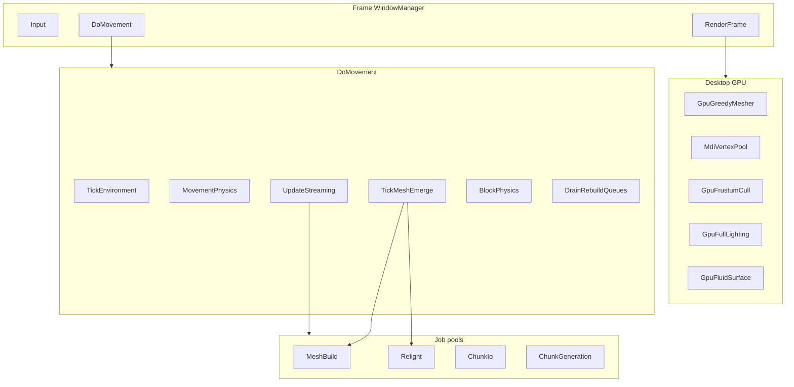

# Engine Performance Audit (all subsystems)

> Date: 2026-07-31  
> Baseline commit lineage: SoftDefer empty-mesh fix `b6e89e28` (ancestor of `HEAD`).  
> Evidence: [`bin/iter_reports/perf_audit_baseline_phaseA.json`](../bin/iter_reports/perf_audit_baseline_phaseA.json)  
> Analyzer: [`bin/iter_reports/_analyze_perf_audit_baseline.py`](../bin/iter_reports/_analyze_perf_audit_baseline.py)  
> Companions: [`streaming/BEST_PRACTICES.md`](streaming/BEST_PRACTICES.md), [`streaming/GPU_PIPELINE.md`](streaming/GPU_PIPELINE.md), [`THREADING_AUDIT.md`](THREADING_AUDIT.md), [`TECH_DEBT_CHUNK_STREAMING.md`](TECH_DEBT_CHUNK_STREAMING.md), [`streaming/MEMORY_BUDGET.md`](streaming/MEMORY_BUDGET.md)

## 1. Scope and invariants

### Deliverable of this audit

Gap matrix per subsystem, ranked levers, and Phase A–F roadmap with GO metrics.  
**Not in this document’s execution:** mass code rewrites. Implementation happens in follow-up PRs, one phase at a time.

### Hard invariants (do not break)

| Invariant | Meaning |
|-----------|---------|
| Algorithm identity | Greedy meshing, skylight/blocklight flood, fluid flood, collision math stay the same. GPU/worker may **execute** the same math under contract tests. |
| SoftDefer / LitReady / ColumnRenderable SoT | `MeshLitGate`, `GetColumnRenderableState`, AllowUnlitFirstMesh predicates unchanged by perf knobs. |
| Threading mailbox | Main schedule → snapshot → worker → `CompletedJobQueue` → main apply. **No GL on mesh/relight workers.** |
| Module isolation | Changes go through `IUChunkMesher` / `IUMeshGpuStore` / `IUChunkCull` / `IULightingPipeline` / `IUFluidSurfaceProvider` and streaming policies — no World↔Render glue. |
| FreeChunk on reject | Do not “keep” GPU mesh after reject/overwrite to hide flicker (regression `103340` opaque collapse). |

### Anti-patterns (proven regressions)

| Attempt | Evidence | Lesson |
|---------|----------|--------|
| Skip FreeChunk / keep dark preview while Pending | `perf_20260731-103340` opaque 1099→239, undrawn | GPU slot hygiene ≠ visual correctness |
| Sticky + SoftDefer-stale + seam expansion package | `perf_20260731-104145` miss/unlit/pend stuck | SoftDefer zoo across subsystems |
| HasDrawable in draw_ok SoT | `perf_20260730-222446` unfinished≈82, fog max | SoT must stay on `HasGreedyMesh` for solids |
| Worker Capture without immutable snapshot | TD-ARCH-015 hang `edge_S1` | Capture stays main until new contract |

### Separate tracks (do not mix)

1. **Perf / wall_ms** — this audit (budgets, GPU hygiene, cull, threading budgets).  
2. **Correctness / land-exit rim** — class `155432`/`184035`: empty SoftDefer placeholders
   (`HasGreedy` + `!Drawable` / `GpuQuadCount=0`) look “built” (collision/cursor) but
   opaque skip; place Immediate used to reject dark rebuild treating empty as lit mesh.
   **Fix landed 2026-07-31:** Immediate/`Commit` `had_mesh=HasDrawable`; Dirty FirstMesh
   sort on `!Drawable`; undrawn heal r≤1; SoftDefer still drops deferred Dirty (no bloat).
   Evidence: autofly `opaque_on_min` 0→70+ vs `land_south_short_v3`; manual verify place-heal.

---

## 2. Method

1. Classify hitch via `FramePerfMonitor` / `PhysicsTelemetry`:  
   `wall_ms` vs `stream_ms` / `mesh_emerge(_prep)` / `relight_drain` / `mesh_immediate` / `scene_ms` / `gpu_cull_ms` / `gpu_mask_readback` / `unaccounted_ms`.
2. Bisect knobs before code: `bin/streaming_tune.json`, `RuntimeTuning`, `render.*`, `procedural.*`.
3. Scenarios: land-exit, cruise (good/bad), SoftDefer-hole, post-drawable-SoT, autofly edge.
4. Per subsystem: Industry → Cubatarium → Gap → lever (algorithm-invariant) → isolation risk → P0–P3.

---

## 3. Phase A — Baseline evidence

Desktop backends on all analyzed manual runs:  
`gpu_greedy` + `mdi_vertex_pool` + `gpu_frustum` + `gpu_full` + `gpu_fluid_surface`.

### 3.1 Wall phase medians (manual sessions)

| Scenario | Log | n | wall med / p95 / max | stream med | emerge med | prep med | relight med | scene med | gpu_mask med | pool_fill med |
|----------|-----|---|----------------------|------------|------------|----------|-------------|-----------|--------------|---------------|
| Land-exit baseline | `155432` | 156 | 161 / 317 / 1030 | 18.3 | **60.9** | 11.5 | 0.4 | 24.9 | 0 | 0.12 |
| Cruise good | `094314` | 275 | 182 / 336 / 1011 | 26.8 | **66.1** | 0.7 | 1.4 | 41.4 | 0 | 0.14 |
| FreeChunk-skip bad | `103340` | 100 | 153 / 242 / 643 | 19.5 | 66.1 | 8.2 | 0.9 | 35.2 | 0 | 0.12 |
| Sticky package empty-exit | `104145` | 141 | 164 / 320 / 1070 | 25.4 | 73.3 | 0.4 | 1.7 | 41.6 | 0 | 0.04 |
| SoftDefer hole | `215919` | 173 | 206 / 349 / 604 | 21.1 | 70.0 | 0.6 | 1.2 | 29.8 | 0 | 0.13 |
| After drawable SoT fix | `223451` | 377 | 170 / 334 / 744 | 18.8 | 50.9 | 8.0 | 0.2 | 35.4 | 0 | 0.20 |

Autofly reference: `edge_qual_fix3` `wall_ms_med≈48`, `gpu_mask_readback_med=0`, `vertex_pool_fill_med≈0.002` (harness cruise, not land-exit debt).

### 3.2 Phase share of wall (land-exit `155432`)

Dominant cost on manual play: **`mesh_emerge_ms` ≈ 38% of wall_med**, then `scene_ms` ≈ 15%, `stream_ms` ≈ 11%.  
`mesh_immediate_ms` median **0** (moving sync ban holds); p95 Immediate still spikes (~73 ms) — idle underfeet path.  
`relight_drain_ms` median low, p95 high (~88 ms) — Capture bursts.  
`gpu_cull_ms` negligible (~0.06 ms).  
`gpu_mask_readback` median **0** on these runs (D1a cruise gate already green for mask); residual sync readback still exists in non-deferred / pipeline fallback code paths (see Phase C).

### 3.3 Visual / correctness tail (not wall, but gates)

| Scenario | Tail miss | unlit | pend | unfinished | opaque last |
|----------|-----------|-------|------|------------|-------------|
| `155432` land-exit | 1 | 15 | 15 | 0 | 287 |
| `094314` cruise good | 0 | 0 | 0 | 0 | **1587** |
| `103340` FreeChunk-skip | 0 | 0 | 0 | 0 | **239** (collapsed) |
| `104145` sticky pkg | 1 | 19 | 19 | 0 | 339 |

**Do not touch (SoT freeze list):** SoftDefer empty-mesh drawable gate as in `b6e89e28`; FreeChunk on GPU reject; AllowUnlitFirstMesh; draw_ok SoT on `HasGreedyMesh` (not drawable-only).

---

## 4. Gap matrix by subsystem

### 4.1 Streaming / column lifecycle — **P0**

| | |
|--|--|
| **Industry** | Single job owner; budgeted admit/commit; light-before-visible; bounded result queues |
| **Cubatarium** | `ColumnFlowExecutor`, SoftDefer, Capture Y-band, DirtyThrash caps, Fog pull-in |
| **Gap** | Manual `wall_ms_med` 160–180 (ARCH_D3 target ≤30 on autofly); Capture still main-thread; land-exit Unlit/Pending plateau |
| **Lever** | Knobs + isolated budget gates only (Phase B). No SoT/FreeChunk changes |
| **Risk** | Low if knobs-only; High if SoftDefer predicates change |
| **TD** | TD-ARCH-032 (wall+sticky), TD-ARCH-033 (rim), land-exit `155432` correctness track |

### 4.2 Mesh build / GPU upload — **P0–P1**

| | |
|--|--|
| **Industry** | Async mesh; single upload; persistent vertex pool; no sync mask readback on cruise |
| **Cubatarium** | `AsyncMeshBuilder` + `UGpuGreedyMesher` + `UMdiVertexPoolStore`; packed path; mask med=0 on baselines |
| **Gap** | Residual `glGetBufferSubData` in fallback / `ProcessSnapshot` / opaque emit; TD-CS-016 full pool rewrite deferred; emerge wall dominates apply/schedule |
| **Lever** | Keep packed path hot; eliminate fallback readback; Reserve/Max + fill% (Phase C) |
| **Risk** | Medium (upload correctness); SoT risk low if apply contracts unchanged |
| **TD** | TD-CS-016, TD-ARCH-019 (done packed), D1 gates |

### 4.3 Lighting — **P1** Desktop / **P3** Android

| | |
|--|--|
| **Industry** | GPU seed/flood on hot path; Capture off critical path |
| **Cubatarium** | Desktop `UGpuFullLightingPipeline`; Capture main + `RelightCaptureBandCy`; sync Relight banned from MeshEmerge |
| **Gap** | Capture-dominated p95; worker Capture hung (TD-ARCH-015); Android CPU seed (TD-ARCH-013b) |
| **Lever** | Capture budget/band knobs first; worker Capture only with immutable snapshot redesign |
| **Risk** | Worker Capture = High; budget knobs = Low |
| **TD** | TD-ARCH-015, TD-ARCH-013b |

### 4.4 Cull / draw / transparent — **P1**

| | |
|--|--|
| **Industry** | GPU frustum → indirect MDI; transparent keys from AABB/cullSphere; no full flat merge per frame |
| **Cubatarium** | `UGpuFrustumCull` + MDI; `GreedyTransparentSort` + optional `GpuTransparentSort`; TD-CS-018 partial |
| **Gap** | Full flat merge still on cache miss; fog pull-in masks unfinished (policy, not shader) |
| **Lever** | Incremental cull (Phase D); transparent cullSphere keys (Phase C); reduce unfinished → less fog pull-in |
| **Risk** | Low–Medium (draw contract) |
| **TD** | TD-CS-018, GPU_PIPELINE D1 |

### 4.5 Fluids / physics — **P2**

| | |
|--|--|
| **Industry** | Surface map GPU; flood often sim-thread with budget; async collision where snapshotted |
| **Cubatarium** | Desktop `UGpuFluidSurfaceMap`; flood CPU main; physics main-only; deferred seed partial (TD-CS-021) |
| **Gap** | Movement hitch every ~16 blocks residual; flood not GPU (algorithm stays CPU by invariant) |
| **Lever** | Hitch throttle + commit/seed budgets; async collision only with new snapshot contract |
| **Risk** | Medium for async collision; Low for budgets |
| **TD** | TD-CS-021 |

### 4.6 Worldgen / IO — **P2**

| | |
|--|--|
| **Industry** | Async gen/IO + commit budget; no GPU worldgen required |
| **Cubatarium** | 5 job pools; async gen/IO defaults on; commit/load budgets |
| **Gap** | Commit/unload hitch contribution to TD-CS-021 |
| **Lever** | Commit/load budget tune; admit block under Soft pressure ([MEMORY_BUDGET](streaming/MEMORY_BUDGET.md)) |
| **Risk** | Low |
| **TD** | TD-CS-021 |

### 4.7 Creatures / GUI / Atlas — **P3**

| | |
|--|--|
| **Industry** | Instanced draws; UI off sim critical path |
| **Cubatarium** | Cross GPU instancing; `CreatureMeshGpuCache`; GUI overlay telemetry separate |
| **Gap** | Share of `scene_ms` not dominant vs emerge; Atlas UV bake CPU (acceptable) |
| **Lever** | Profile-only until emerge/stream below target |
| **Risk** | Low |
| **TD** | none primary |

---

## 5. Top-5 levers (impact × SoT-risk)

Ranked for **next implementation order**. Impact = expected effect on `wall_ms` / hitch class. SoT-risk = chance of visual/regression like `103340`/`222446`.

| Rank | Lever | Expected impact | SoT-risk | Phase |
|------|-------|-----------------|----------|-------|
| **1** | Main-thread Capture / DirtyThrash / Immediate **budget knobs** only | High on emerge/stream p95 (Capture+Dirty loops) | **Low** | B |
| **2** | Mesh emerge path hygiene: apply/schedule caps under Yellow/Red (no SoT change) | High — emerge is ~38% wall_med | **Low–Med** | B |
| **3** | GPU hot-path: keep mask readback=0; kill fallback `glGetBufferSubData`; MDI fill%/Reserve | Med on `scene`/upload stalls; cruise already mask=0 | **Low** | C |
| **4** | Incremental frustum cull without full flat merge (TD-CS-018) | Med on `scene_ms` when cache cold | **Low** | D |
| **5** | TD-CS-021 commit/seed budgets (physics remain main) | Med on movement hitch | **Low** | E |

**Explicitly not in top-5 (wrong risk profile):** FreeChunk-skip, SoftDefer predicate zoo, worker Capture without snapshot redesign, greedy/light algorithm changes.

---

## 6. Phase B — Streaming budget scope (detailed)

**Status: LANDED 2026-07-31** — knobs in `URuntimeTuning` + wired into Capture /
Immediate / fly-cap / MemoryBudget hitch / Fog timing. SoftDefer SoT and FreeChunk
unchanged.

**Default deltas (vs pre-B hardcoded):**
- `MeshFlyCapYellow/Red` 10/8 → **8/6**; wall fly baselines 8/12/16 → **6/10/12** (holes 8/12)
- `ImmediateBudget` 4/6 @24ms → **3/5 @22ms**
- `DirtyThrashSoftCap` 400 → **320** (low/high tiers 240/480)
- `MemoryHitchCaptureWallMs` 500 → **400**
- Capture drain ms defaults **unchanged** (3/8/5/10/6/12) — only tunable now

**Goal:** Lower `wall_ms_med` / spike rate while preserving holes/opaque/sticky gates and SoftDefer SoT.

### In scope

| Area | Files | What |
|------|-------|------|
| Capture wall budget | [`WorldPersistence.cpp`](../src/World/Persistence/WorldPersistence.cpp) `DrainRelightQueues` | `CaptureDrain*Ms`, `CaptureHotFrameMult`, sync/idle skip walls, `CaptureMovingBgCap` |
| Capture band | `RuntimeTuning.RelightCaptureBandCy` (default 4) | Iterate 2–4; 0=full column forbidden under load |
| Dirty thrash | `DirtyThrashSoftCap` (320), `DirtyThrashAsyncMin`, `DirtySoftCap` | Remesh drop sooner under Yellow/async |
| Immediate gate | [`ChunkEmergeCoordinator.cpp`](../src/World/Streaming/ChunkEmergeCoordinator.cpp) | `ImmediateBudget*Ms` / `ImmediateHotWallMs`; moving sync ban kept |
| Mesh fly schedule | same emerge file | `MeshFlyCapWall*` / `MeshFlyCapHoles*` then pressure Yellow/Red |
| Fog pull-in | [`WorldStreaming.cpp`](../src/World/Streaming/WorldStreaming.cpp) | `FogPullInExpand/ShrinkSec`, `FogPullInSevereWallMs` only |
| Memory pressure | [`MemoryBudgetController`](../src/World/Streaming/MemoryBudgetController.cpp) | `MemoryGreenMaxWallMs`, `MemoryHitchCaptureWallMs`, `MemoryUrgentEvalWallMs` |

### Out of scope (Phase B)

- SoftDefer / `MeshLitGate` / `HasDrawable` SoT changes  
- FreeChunk / AllocateSlot reuse policy changes  
- Worker Capture (TD-ARCH-015)  
- Sticky / seam expansion / CollectStale underfeet packages that regressed `104145`

### Knobs checklist (`streaming_tune.json` / `RuntimeTuning`)

```
relight_capture_band_cy
dirty_thrash_soft_cap / dirty_thrash_async_min / dirty_soft_cap
pending_light_soft_cap / relight_fifo_soft_cap
mesh_fly_cap_yellow / mesh_fly_cap_red / recover_n_boost
mesh_fly_cap_wall_hot|mid|ok / mesh_fly_cap_holes_hot|ok
mesh_fly_wall_hot_ms / mesh_fly_wall_mid_ms
capture_drain_*_ms / capture_hot_frame_mult / capture_sync_skip_wall_ms
capture_idle_pending_max_wall_ms / capture_moving_bg_cap
immediate_budget_hot_ms / immediate_budget_ok_ms / immediate_hot_wall_ms
memory_green_max_wall_ms / memory_hitch_capture_wall_ms / memory_urgent_eval_wall_ms
fog_pull_in_expand_sec / fog_pull_in_shrink_sec / fog_pull_in_severe_wall_ms
mesh_completed_slots / relight_completed_slots
memory_soft_mb / memory_expand_keep_mb
```

### GO metrics (Phase B)

| Metric | Target | Notes |
|--------|--------|-------|
| Autofly `wall_ms_med` | ≤30 (ARCH_D3) or stepwise ≤35 then ≤30 | `tools/flight_sim_phase_gate.py` |
| Manual land-exit `wall_ms` p95 | ↓ vs `155432` baseline 317 | Same scenario length |
| `mesh_immediate_ms` med while moving | 0 | Must hold |
| `holes_rate` / `post_stop_black_sticky_max` | no regress vs prior autofly GO | |
| `opaque_cmd_on` cruise end | not collapse (guard vs `103340`) | |
| SoftDefer SoT unit tests | PASS | |

---

## 7. Phase C — GPU hot-path hygiene (detailed)

**Status (partial, 2026-07-31):** `gpu_mask_readback_med=0` on manual `194759`.
GPU BlockType counting-sort path compiled (hist+dark readback, scatter in-slot)
but **disabled by default** (`kGpuSortMinQuads = max+1`): AMD iGPU SSBO atomics
regressed `emerge_med` 67→85 when enabled. Typical path remains CPU counting-sort.
Schedule clamp + apply drain boost remain. Residual: enable GPU sort on discrete
GPUs / non-atomic algorithm; occupancy upload / counter sync; MDI/transparent.

**Goal:** D1 best practices from [`GPU_PIPELINE.md`](streaming/GPU_PIPELINE.md): cruise `gpu_mask_readback_med==0`, single upload path, transparent keys from AABB/cullSphere, MDI fill% healthy.

### In scope

| Work item | Files | Notes |
|-----------|-------|-------|
| Mask readback stay-zero | [`GpuGreedyMesher.cpp`](../src/Render/Mesh/GpuGreedyMesher.cpp) (~256–265) | Path that `glGetBufferSubData` + `++gMaskReadbacks` must not run on cruise (prefer deferred/packed). Gate: `gpu_mask_readback_med≤0` |
| Pipeline counters readback | [`GpuMeshPipeline.cpp`](../src/Render/Mesh/GpuMeshPipeline.cpp) `ProcessSnapshot` | Replace sync counter/vert readback with persistent mapping or GPU-resident apply where contract allows **same** mesh output |
| Opaque emit fallback | [`GpuGreedyOpaqueEmit.cpp`](../src/Render/Mesh/GpuGreedyOpaqueEmit.cpp) | Same: no sync SSBO read on hot path |
| MDI pool Reserve/Max | [`MdiVertexPoolStore.cpp`](../src/Render/Engine/MdiVertexPoolStore.cpp), `GpuVertexPoolReserveMb` / `MaxMb` | fill% telemetry already; grow policy per MEMORY_BUDGET; step toward TD-CS-016 without Nick-McDonald full rewrite |
| Transparent keys | [`GreedyTransparentSort.cpp`](../src/Render/Pipeline/GreedyTransparentSort.cpp), [`GpuTransparentSort.cpp`](../src/Render/Pipeline/GpuTransparentSort.cpp), [`GeometryEngine.cpp`](../src/Render/Engine/GeometryEngine.cpp) prepare | AABB/cullSphere distance keys; keep revision cache; Desktop may use GPU sort, GLES single-pass |

### Out of scope (Phase C)

- New mesher algorithm / different greedy merge  
- FreeChunk-skip  
- Android GLES lighting seed (Phase F / TD-ARCH-013b)  
- Changing SoftDefer

### Tests / gates

| Test / gate | Role |
|-------------|------|
| `gpu_greedy_face_extract_test` | MergeOpaqueQuadsStrict equivalence |
| `mesh_gpu_store_mdi_test` | Pool allocate/free contracts |
| `render_backend_factory_test` | Desktop bind matrix |
| `GreedyTransparentSort` unit | Sort revision / key stability |
| Flight gate **D1a–D1d** | `gpu_mask_readback_med≤0`, `vertex_pool_fill_med≤0.85` ([`flight_sim_phase_gate.py`](../tools/flight_sim_phase_gate.py)) |

### GO metrics (Phase C)

| Metric | Target |
|--------|--------|
| `gpu_mask_readback_med` | **0** (must not regress) |
| `vertex_pool_fill_med` | ≤0.85; prefer stable ≤0.5 on med tier cruise |
| `backend_*` | stay `gpu_greedy` / `mdi_vertex_pool` / `gpu_frustum` / `gpu_full` / `gpu_fluid_surface` |
| Mesh face contract tests | PASS |
| No opaque collapse on cruise | opaque_on_min / end opaque healthy |

---

## 8. Roadmap Phase D–F (summary + GO)

### Phase D — Incremental cull (P1)

- **TD-CS-018:** frustum-only path when `LastVisibleChunks` / revision cache hit; avoid full flat merge.  
- Files: GeometryEngine greedy prepare / flat merge path; `UGpuFrustumCull`.  
- **GO:** `scene_ms` med ↓ on cruise autofly; draw contract / ColumnRenderable unchanged; unit cull tests PASS.

### Phase E — Threading expansion where safe (P1–P2)

- Finish TD-CS-021 remainder: relight/commit budgets, physics seed queue — **main-thread budgets**, not new collision algorithm.  
- Worker Capture (TD-ARCH-015): **only if** Phase A-class evidence shows Capture-dominated wall **and** immutable capture snapshot exists without world races; otherwise mark **wont-fix** with rationale.  
- Do not retune global 5-pool layout without contention proof ([THREADING_AUDIT](THREADING_AUDIT.md)).  
- **GO:** movement hitch cadence ↓; no new cross-thread world races; quiesce/WaitIdle still sound.

### Phase F — Fluids / Android GPU (P2–P3)

- Desktop fluid surface hitch throttle audit (`FluidSurfaceMap` / `UGpuFluidSurfaceMap`). Flood stays CPU (invariant).  
- Android TD-ARCH-013b skylight seed when Desktop F2/C/CB stable.  
- **GO:** fluid hitch not in top wall contributors; Android gates AG* when enabled.

---

## 9. Frame architecture (reference)



---

## 10. Out of scope (explicit)

- Changing greedy / light-flood / fluid-flood / collision algorithms  
- SoftDefer zoo / FreeChunk-skip / drawable-in-SoT  
- Worker GL  
- Mixing land-exit correctness (`155432`) into GPU pool PRs  
- Android-first work before Desktop Phase B–C GO  

---

## 11. Success criteria for this audit document

- [x] Seven subsystems with gap, lever, isolation risk, P-priority, TD link  
- [x] Top-5 levers ranked by impact × SoT-risk  
- [x] Phase B knobs/budget-only scope without SoftDefer/FreeChunk  
- [x] Phase C mask/MDI/transparent files + tests  
- [x] Phase A–F GO metrics  
- [x] Baseline evidence table + JSON artifact  
- [x] Land-exit debt called out as separate correctness track  

## 12. Next action after audit approval

**Phase B landed** (Capture/Immediate/fly/DirtyThrash/Memory hitch/Fog timing knobs).
Validate with autofly + manual land-exit vs `155432`, then implement **Phase C** GPU
hygiene PR.
