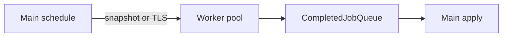

# Threading audit

Inventory of multithreading sites, cross-thread artifacts, concurrency patterns,
and residual risks. Companion to streaming crash/perf work.

Legend: **Risk** L / M / H.

## A. Job infrastructure

| Site | Files | Shared data | Sync | Risk |
|------|-------|-------------|------|------|
| `UJobThreadPool` / `UCompletedJobQueue` | `src/Core/Jobs/JobThreadPool.*` | job queue, completed mailbox | mutex + CV; completed mutex | L |
| `JobPoolKind` budget (5 pools × ≤4) | `src/Core/Jobs/JobThreadBudget.*` | sizing only | none | M (up to ~20 threads, no global cap) |
| TLS `job_kind` | `CubatariumSetWorkerJobKind` via pool ctor | thread-local string | TLS | L |

## B. Worker pools

| Pool | Files | Shared / artifacts | Sync | Risk |
|------|-------|--------------------|------|------|
| MeshBuild | `AsyncMeshBuilder`, `ChunkMeshCache` | owned `ChunkMeshSnapshot`; raw `UBlockRegistry*` | snapshot + epoch/jobId + InFlightMutex | M |
| Relight | `AsyncRelightBuilder` | owned relight snapshot; raw registry; capture mutex | capture mutex + epoch | L–M |
| ChunkIo | `AsyncChunkIO`, `WorldPersistence` | bytes/path; generation token | serialize-on-main; disk on worker | L after registry-sequence check |
| ChunkGeneration | `ChunkLoadScheduler` | shared populator / registry / ObjectLibrary | token + shouldCancel; apply-on-main | M |
| CoopGeneration | `WorldCooperativeOps` | same populator | completed queue; WaitIdle on main | M |

## C. Tokens / epoch / quiesce

| Site | Files | Sync | Risk |
|------|-------|------|------|
| `UChunkGenerationRegistry` | `ChunkGenerationToken.*` | mutex | L |
| Mesh/Relight epoch | Async builders | atomics | L |
| Quiesce pipeline | `World`, `WorldStreaming`, `WorldOperationRunner` | cancel + WaitIdle timeout | L–M |
| `RefreshBlockRegistry` | `World.cpp` | **QuiesceBackgroundWork** before mutate | L |

## D. Snapshots / TLS (sound patterns)

| Site | Files | Risk |
|------|-------|------|
| Mesh/Relight value snapshots | ChunkMesh/RelightSnapshot | L |
| TLS `ThreadLocalPipelineState` | `PipelineChunkPopulator.cpp` | L (world); shared catalogs see E |
| ObjectLibrary `GetShared` / TLS keep in `Get` | `ObjectLibrary.*` | L–M if `Get` used across yield |

## E. Catalog / prefab / pack

| Site | Files | Artifact | Sync | Risk |
|------|-------|----------|------|------|
| `BlockDefinitionStorage::Active` | `BlockDefinitionStorage.*` | RCU `shared_ptr` | `atomic_load` / `atomic_store` | L |
| Removed dangling `GetAll()` | — | use `GetCatalogSnapshot()` | — | fixed |
| `UBlockRegistry` maps | `BlockRegistry.*` | rebuild under quiesce | none on maps during rebuild | M if quiesce skipped |
| `UBlockMergeRegistry` | `BlockMergeRegistry.*` | lookups | shared_mutex | L |
| `UObjectLibrary` | `ObjectLibrary.*` | `shared_ptr` defs | shared_mutex + owned ptr | L |
| `UWorldGenPack` / feature / refs | `WorldGenPack`, configs | static global | quiesce on reload | M if hot-reload without quiesce |

## F. Other

| Site | Note | Risk |
|------|------|------|
| glog | any thread after init | L |
| Creature caches | usually main | L |
| Progressive queues / physics | main-only | L |

## Pattern verdict

**Sound for voxel data:** schedule on main → snapshot/TLS on worker → completed mailbox → apply on main; generation tokens; mesh/relight epoch discard.

**Fixed in this pass:**

1. Async IO token validation now compares against `ChunkGenTokens.Current(ground).sequence` (was self-compare).
2. Catalog publish is atomic; `GetAll()` removed in favor of snapshots.
3. `ObjectLibrary` stores `shared_ptr` definitions; `GetShared` for safe lifetime.
4. `RefreshBlockRegistry` quiesces background work first.
5. Worker pools stamp TLS `job_kind` for crash logs.

**Still watch:**

- Raw `UBlockRegistry*` in mesh/relight jobs if Reload runs without full quiesce.
- Static WorldGenPack during hot reload.
- Coop WaitIdle on main under load.
- No global thread throttle across five pools.
