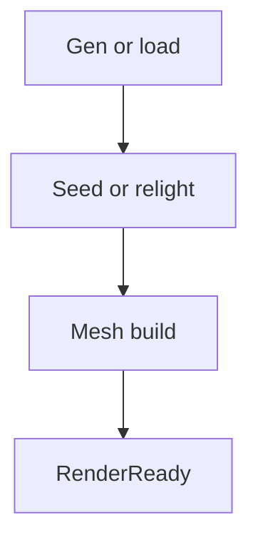

# Architecture Options

## Контекст

В Cubatarium уже были опробованы разные формы priority streaming, delayed
remesh и relight recovery. Этот документ отделяет:

- исторические попытки (`R1-R14`);
- целевые архитектурные варианты;
- критерии, по которым их стоит сравнивать.

## Decision Matrix

| Критерий | V1 incremental | V2 strict visual | V3 seed-at-commit | V4 unified scheduler |
|----------|----------------|------------------|-------------------|----------------------|
| Убирает dark preview | частично | да | да | да |
| Убирает `pending_light` trail | частично | частично | да | да |
| Риск регрессий | высокий | средний | средний | высокий |
| Стоимость внедрения | низкая | средняя | средняя | высокая |
| Соответствие best practices | низкое | высокое | высокое | высокое |

## V1. Incremental + Pressure

Текущая модель:

- отдельные очереди gen / relight / mesh;
- `PendingLightBeforeMesh`;
- `forward wedge`;
- `StarveRemeshForHoles`;
- Green/Yellow/Red pressure;
- набор watchdog-путей.

Плюсы:

- минимальный diff к текущей ветке;
- не требует крупного рефакторинга.

Минусы:

- сложнее всего доказывать инварианты;
- telemetry и scheduler разговаривают на разных языках;
- история уже показала, что эта модель легко расползается в recovery zoo.

Вердикт: нужен как baseline и переходное состояние, но не как целевая
архитектура.

## V2. Strict VisualReady

Идея:

- колонка считается видимой только когда она `RenderReady`;
- mesh preview до света не рисуется;
- `visual_holes` остаётся метрикой отсутствующего mesh;
- `unfinished_visual` становится главным render gate.

Плюсы:

- сразу устраняет главный класс визуальных багов: чёрный terrain при наличии
  mesh;
- упрощает flight-sim gates;
- даёт чёткий пользовательский SLA.

Минусы:

- если relight pipeline медленный, вместо чёрного preview будут пустые окна;
- нужна дисциплина во всех местах, где mesh раньше появлялся «по эвристике».

Вердикт: обязательная краткосрочная база.

## V3. Commit-Time Skylight Seed

Идея:

- если соседний ring загружен, skylight seed запускается прямо на commit;
- emerge column не уходит в длинный async relight backlog;
- full relight остаётся для player edits и сложных frontier cases.

Плюсы:

- лучше всего сокращает `PendingLight` debt;
- ближе всего к тому, как устроены mature voxel pipelines;
- упрощает `stop-recovery`.

Минусы:

- требует чётко определить, когда соседний контекст достаточен;
- возможны дополнительные wall spikes, если seed запускать без budget guard.

Вердикт: рекомендованное среднесрочное развитие после strict `RenderReady`.

## V4. Unified Column Scheduler

Идея:

- один scheduler отвечает за жизненный цикл колонки;
- у колонки есть явный job graph;
- приоритеты задаются по ring/SLA, а не разрозненными recovery path.

Пример целевой последовательности:

Плюсы:

- устраняет ghost ownership;
- делает timeout/requeue естественной частью job model;
- радикально упрощает reasoning о системе.

Минусы:

- самый дорогой путь;
- легко расползтись в большой рефакторинг, если начать с него сразу.

Вердикт: делать только после стабилизации контракта V2+V3.

## V5. Ring-Based Visual SLA

Идея:

- `FOV ring`: strict zero unfinished visual after bounded stop time;
- `keep ring`: best-effort фоновая достройка;
- метрики и budgets разделяются по ring semantics.

Это не самостоятельный pipeline, а policy layer поверх V2-V4.

## V6. Subchunk / GPU Refactor

Идея:

- subchunk 16^3;
- finer-grained remesh;
- GPU-friendly draw orchestration.

Этот путь может сильно улучшить производительность, но не решает сам по себе
логическую проблему `mesh visible before light ready`.

## Watchdog Map Текущей Архитектуры

| Механизм | Роль | Риск |
|----------|------|------|
| `MarkRelitChunksForMesh` | event-driven lit->mesh | нормальный primary path |
| `PromotePendingLightRelightsNear` | requeue stuck relight | ghost duplication |
| `RecoverUnlitFocusMeshes` | bounded focus scan | dirty flood |
| `AdmitFocusMeshIngress` | вернуть missing в scheduler | повтор с другими ingress |
| `AdmitFocusLightingWithoutDirty` | recover trail columns | размазывает ownership |
| `AdmitFocusVisibleMissing` | pure missing recovery | конкурирует с starve |
| `ClearPendingLightAfterMeshCommitted` | pending->renderready cleanup | зависит от mesh drain cadence |

Главный вывод: проблема не в том, что recovery paths существуют, а в том, что
они распределяют ownership одной и той же колонки между несколькими
механизмами.
