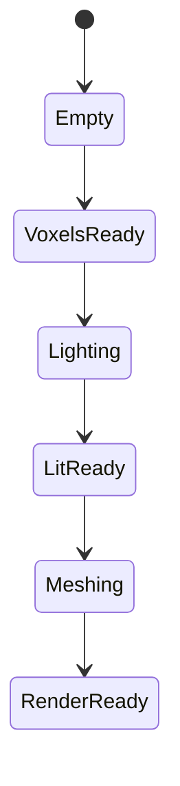

# Implementation Plan

## Цель

Устранить ситуации, когда при движении в новые области:

- колонка не имеет mesh;
- mesh есть, но колонка остаётся тёмной;
- `pending_light_focus` застревает после остановки;
- autofly и manual дают разные выводы о готовности мира.

## Целевой Контракт

Правила:

1. Draw разрешён только для `RenderReady`.
2. `visual_holes` = отсутствующий mesh.
3. `unfinished_visual` = отсутствующий mesh или ещё неготовый свет.
4. `pending_light_focus` должен уходить к нулю в stop recovery.

## Фаза 0. Документация

Артефакты:

- `README.md`
- `EVOLUTION.md`
- `ARCHITECTURE_OPTIONS.md`
- `BEST_PRACTICES.md`
- этот файл

## Фаза 1. Strict Visual Contract

Изменения:

- добавить `IsColumnRenderReady`;
- разделить `visual_holes` и `unfinished_visual`;
- убрать first-mesh preview для колонок с `PendingLight`;
- перестроить flight-sim gates вокруг нового поля.

Критерий:

- stop segment не содержит тёмных preview chunks;
- `unfinished_visual` становится главным показателем незавершённого мира.

## Фаза 2. Focus Drain

Изменения:

- централизовать drain pending/render-ready cleanup в одном helper;
- при idle делать priority drain вокруг focus ring;
- не завязывать recovery только на raw `visual_holes`.

Критерий:

- `pending_light_focus` не стоит на месте при хорошем `wall_ms`;
- stop plateau сокращается.

## Фаза 3. Commit-Time Skylight Seed

Изменения:

- near-focus commit сначала пробует быстрый skylight seed, если соседний ring
  уже загружен;
- async relight остаётся fallback path;
- `PendingLight` используется только если seed небезопасен или недостаточен.

Критерий:

- уменьшается медиана `pending_light_focus`;
- уменьшается доля `unfinished_visual` в stop segment.

## Фаза 4. Unified Column Flow

Изменения:

- общий helper/flow для focus column work;
- снижение прямой связности между отдельными watchdog branches;
- постепенное сворачивание recovery zoo к единому scheduler ownership.

Критерий:

- для одной и той же колонки меньше дублирующих recover paths;
- легче читать и расширять scheduler.

## Фаза 5. Harness Parity

Изменения:

- `flight_sim_run.py --replay-manual`;
- анализатор понимает `unfinished_visual`;
- gates stop/fly привязаны к новому render contract.

Критерий:

- replay manual route и обычный fly-stop меряют одну и ту же проблему;
- отчёт различает `missing mesh` и `render unfinished`.

## Anti-Patterns

Не возвращаться к следующим решениям:

- `empty mesh == hole` глобально;
- `MarkDirty` всего focus ring на каждом idle tick;
- sync relight flood как универсальный recovery;
- preview mesh до завершения света.

## Статус (2026-07-21, после Era 11)

### Evidence regress

`perf_181020` (HEAD `fba28746`): stop `not_ready_end=90`, `black_sticky=32`,
`pending_med=53`, `dirty→705`, `relight≈0.027`, gates_stop **2/9**.

Last-good: `2cb85f3c` / `perf_165208` — sticky=0, pending→0, not_ready≈25
(только lit-but-dirty).

### Системный план (исполнение)

Порядок: **H** anti-hang harness → **D** docs → **R** revert×4 → **V2a**
RenderReady → **V2b** single owner → **V3** async seed → **F** final gates.
Каждая фаза: autofly + `flight_sim_phase_gate.py` → git commit.

`DrainIdleFocusVisualWork` / R15–R18 — **не** целевое решение; после revert
baseline = `2cb85f3c` + anti-hang.

### Harness & hang

- `tools/flight_sim_run.py`: preflight/postflight `taskkill`, process-timeout,
  `hang_killed` в report, `flight_sim_phase_history.jsonl`.
- Flight-sim: report **до** `PrepareForShutdownFast()` (короткие joins).
- `tools/flight_sim_phase_gate.py`: go/no-go по phase-id.

### Фазы (checklist сброшен к post-`2cb85f3c`)

| Фаза | Статус | Примечание |
|------|--------|------------|
| 0 Документация | ✅ Era 11 | этот апдейт |
| H Anti-hang | ✅ | `7c487c83` + `_Exit` follow-up |
| R Revert regress | ✅ | sticky=0, chunks≥3, hang=false |
| 1 Visual contract V2a | ✅ | no preview; sticky=0 |
| 2 Single owner V2b | ✅ | bounded idle drain |
| 3 Skylight seed V3 | ✅ | priority async when neighborhood OK |
| 5 Harness gates F | ✅ | sticky=0, stop_wall≈20, pending≈29 |

Evidence: `bin/flight_sim_gate_report_baseline_2cb85f3c.json`,
`bin/flight_sim_gate_report_V2b.json`, `bin/flight_sim_gate_report_V3.json` /
`final.json`. Soft F closed pending→0 on autofly; F2 lit-but-dirty still open.

### Manual evidence `perf_20260722-081734` (HEAD `38064157`)

Фокус `-492,31`. В целом ок: sticky=0, wall med≈22, pending→0, missing→0 к концу.

Два разных хвоста (не путать):

| Фаза | Симптом | Телеметрия | Что видит игрок |
|------|---------|------------|-----------------|
| **A Ingress** | дыра на границе новой области | `holes=1 miss=1`, часто **`async=0` + `snap=0`**, `pending` 2–15, `relight_drain≈0` (сегменты ~26–30) | колонка **никогда не мешится**, пока PendingLight не снят (V2a soft-defer) |
| **B Idle wait** | «долго жду — не чинится» | после pending→0: **`async=42` flat**, `nr` 42→59 ↑, `fd` 457→525 ↑, `ahead`≈35 | unfinished растёт при здоровом wall; remesh thrash, не hole |

Вывод: P0 = **frontier missing + cold relight** (A), не F2 Dirty drain.
F2 (B) остаётся P1: idle remesh plateau / RemeshAfterApply.

### Следующие шаги (скорректировано 2026-07-26)

Streaming ladder **H→CB закрыт** на `opt_3d` (`cb_pack`, wall gate ≤37). См.
`PHASE_EXECUTION.md` § CB accepted.

1. **Pre-merge:** `PREMERGE_CHECKLIST.md` — Release/RelWithDebInfo golden F2+C+CB,
   optional `--replay-manual` parity, merge `opt_3d` → целевая ветка.
2. **Memory budget validation:** checklist в `MEMORY_BUDGET.md` (private p95 /
   completed fill% / SoftCap) — код landed, harness evidence ещё тонкий.
3. **GPU pipeline:** дальше perf/parity MDI (`GPU_PIPELINE.md`), не stream-дыры.
4. Soft: редкие `spike_max_wall` без holes (~1–4 s) — только при UX-регрессе.

### Anti-Patterns (не возвращать)

- `empty mesh == hole` глобально
- `MarkDirty` всего focus ring на idle tick (R15)
- sync relight/remesh flood (R10, R16, R17)
- preview mesh до завершения света (R5)
- async-only drain без ownership/throughput (R18)
