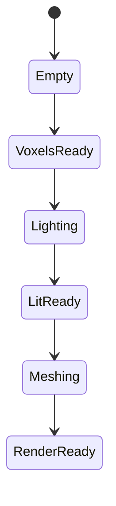

# Implementation Plan

## Цель

Устранить ситуации, когда при движении в новые области:

- колонка не имеет mesh;
- mesh есть, но колонка остаётся тёмной;
- `pending_light_focus` застревает после остановки;
- autofly и manual дают разные выводы о готовности мира.

## Целевой Контракт

Правила:

1. Draw разрешён только для `RenderReady`.
2. `visual_holes` = отсутствующий mesh.
3. `unfinished_visual` = отсутствующий mesh или ещё неготовый свет.
4. `pending_light_focus` должен уходить к нулю в stop recovery.

## Фаза 0. Документация

Артефакты:

- `README.md`
- `EVOLUTION.md`
- `ARCHITECTURE_OPTIONS.md`
- `BEST_PRACTICES.md`
- этот файл

## Фаза 1. Strict Visual Contract

Изменения:

- добавить `IsColumnRenderReady`;
- разделить `visual_holes` и `unfinished_visual`;
- убрать first-mesh preview для колонок с `PendingLight`;
- перестроить flight-sim gates вокруг нового поля.

Критерий:

- stop segment не содержит тёмных preview chunks;
- `unfinished_visual` становится главным показателем незавершённого мира.

## Фаза 2. Focus Drain

Изменения:

- централизовать drain pending/render-ready cleanup в одном helper;
- при idle делать priority drain вокруг focus ring;
- не завязывать recovery только на raw `visual_holes`.

Критерий:

- `pending_light_focus` не стоит на месте при хорошем `wall_ms`;
- stop plateau сокращается.

## Фаза 3. Commit-Time Skylight Seed

Изменения:

- near-focus commit сначала пробует быстрый skylight seed, если соседний ring
  уже загружен;
- async relight остаётся fallback path;
- `PendingLight` используется только если seed небезопасен или недостаточен.

Критерий:

- уменьшается медиана `pending_light_focus`;
- уменьшается доля `unfinished_visual` в stop segment.

## Фаза 4. Unified Column Flow

Изменения:

- общий helper/flow для focus column work;
- снижение прямой связности между отдельными watchdog branches;
- постепенное сворачивание recovery zoo к единому scheduler ownership.

Критерий:

- для одной и той же колонки меньше дублирующих recover paths;
- легче читать и расширять scheduler.

## Фаза 5. Harness Parity

Изменения:

- `flight_sim_run.py --replay-manual`;
- анализатор понимает `unfinished_visual`;
- gates stop/fly привязаны к новому render contract.

Критерий:

- replay manual route и обычный fly-stop меряют одну и ту же проблему;
- отчёт различает `missing mesh` и `render unfinished`.

## Anti-Patterns

Не возвращаться к следующим решениям:

- `empty mesh == hole` глобально;
- `MarkDirty` всего focus ring на каждом idle tick;
- sync relight flood как универсальный recovery;
- preview mesh до завершения света.

## Статус (2026-07-21)

### Сделано (коммит `ee54b86d` + follow-up)

| Фаза | Статус | Примечание |
|------|--------|------------|
| 0 Документация | ✅ | `docs/streaming/*` |
| 1 Visual contract | ⚠️ частично | `visual_holes`/`unfinished_visual` в perf; preview при PendingLight оставлен |
| 2 Focus drain | ⚠️ частично | `DrainColumnWork`, idle при `pending>0`, promote/sync helpers |
| 3 Skylight seed | ⚠️ частично | partial `CanSeedSkylightAtCommit` (3/4 cardinals); sync seed только underfeet |
| 4 Unified flow | ⚠️ частично | helpers есть, recovery zoo не свёрнут |
| 5 Harness | ⚠️ частично | `--manual-idle`, `analyze_manual_idle.py` |

### Ручной пролёт `perf_20260721-155539` (~90 с)

| Метрика | Было (до fix) | Стало |
|---------|---------------|-------|
| `visual_holes` | 0 | **0** ✅ |
| `pending` stop tail | ~5 плато | **2** (лучше, не 0) |
| `relight_drain_ms` stop | ~0 | **~0.02** ❌ stall |
| `dirty_med` | ~560 | **~427** (лучше) |
| sync spikes | — | **3–7 с** (DrainIdleFocusPendingLightSync) |

Вывод: mesh-контракт держится; light debt снижается, но **последние 2–5 колонок** и **relight FIFO stall** остаются.

### Осталось (приоритет)

**P0 — Relight stall при малом pending**

- [x] `pending_cols` в perf jsonl + glog `visual_holes` отдельно от `holes`
- [x] Stall watchdog: empty FIFO + no inflight → re-promote + `ClearPendingLightAfterMeshCommitted`
- [ ] Проверить на следующем manual: `pending→0`, `relight_drain>0` при stop

**P0 — Sync relight без спайков**

- [x] Sync только при `pending 2–5`, `wall≤16ms`, 1 col / 60 frames
- [ ] Если спайки остаются — убрать sync path, только async + MarkRelit flush

**P1 — Dirty idle cap**

- [ ] При `visual_holes=0` starve far remesh сильнее → `dirty_med < 300` @ idle

**P1 — Quit path**

- [ ] Quiesce перед save, perf `kind=shutdown`, не генерировать frontier при exit

**P2 — Harness**

- [ ] Autofly resume в manual-зону с движением `chunks_traveled≥3`
- [ ] Gate: `healthy_unfinished_rate` при `wall<30` и `pending≤5`
