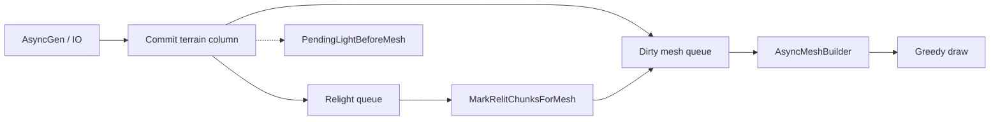
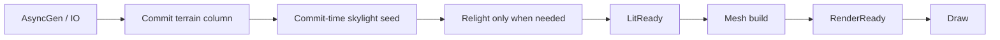

# Streaming Visualization

Этот каталог собирает техническую историю и дорожную карту по проблемам
визуализации мира при входе в новые области.

## Документы

- `ROOT_CAUSE_2026-07.md` — почему фиксы не кончаются (Era 13 / manual_1752).
- `EVOLUTION.md` — эволюция streaming/light/mesh (Era 1–13, R1–R24).
- `MEMORY_BUDGET.md` — byte-budget, overflow/expand policies, knobs, gates.
- `ARCHITECTURE_OPTIONS.md` — варианты архитектуры, Era 13 decisions, anti-zoo.
- `BEST_PRACTICES.md` — industry gap (Hide⇒Ticket, async floor, SoT).
- `IMPLEMENTATION_PLAN.md` — целевая архитектура, фазы реализации и критерии
  приёмки.
- `PHASE_EXECUTION.md` — лог прогонов и memory-crisis notes (`214430` / `220018` / `221846`).

## Текущий pipeline (до V2)

Проблема: draw возможен при `PendingLight` (preview mesh), поэтому
`visual_holes=0` не означает готовность картинки.

## Целевой pipeline

Целевой инвариант: `видимое = RenderReady`, а не просто `mesh существует`.
PendingLight не должен вести в Draw.
