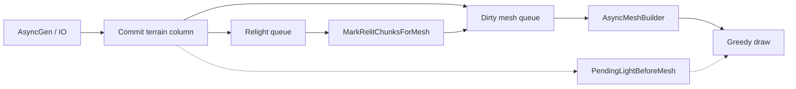
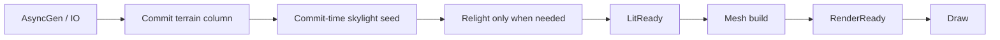

# Streaming Visualization

Этот каталог собирает техническую историю и дорожную карту по проблемам
визуализации мира при входе в новые области.

## Документы

- `EVOLUTION.md` — полная эволюция streaming/light/mesh, 10 эр, ключевые
  коммиты и повторяющиеся регрессии.
- `ARCHITECTURE_OPTIONS.md` — принципиально разные варианты архитектуры и
  decision matrix.
- `BEST_PRACTICES.md` — сравнение Cubatarium с индустриальными практиками
  voxel-движков.
- `IMPLEMENTATION_PLAN.md` — целевая архитектура, фазы реализации и критерии
  приёмки.

## Текущий pipeline

Проблема текущего пути: колонка может быть уже видима как mesh, но ещё не
быть визуально готовой, потому что baked skylight/blocklight не дошёл до
рендерного результата.

## Целевой pipeline

Целевой инвариант: `видимое = RenderReady`, а не просто `mesh существует`.
