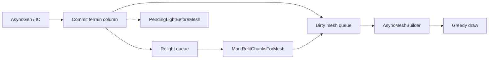
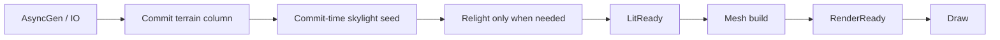

# Streaming Visualization

Этот каталог собирает техническую историю и дорожную карту по проблемам
визуализации мира при входе в новые области.

## Документы

- `EVOLUTION.md` — полная эволюция streaming/light/mesh, 11 эр, ключевые
  коммиты и повторяющиеся регрессии (включая Era 11 / R15–R18).
- `ARCHITECTURE_OPTIONS.md` — принципиально разные варианты архитектуры и
  decision matrix.
- `BEST_PRACTICES.md` — сравнение Cubatarium с индустриальными практиками
  voxel-движков.
- `IMPLEMENTATION_PLAN.md` — целевая архитектура, фазы реализации и критерии
  приёмки.

## Текущий pipeline (до V2)

Проблема: draw возможен при `PendingLight` (preview mesh), поэтому
`visual_holes=0` не означает готовность картинки.

## Целевой pipeline

Целевой инвариант: `видимое = RenderReady`, а не просто `mesh существует`.
PendingLight не должен вести в Draw.
