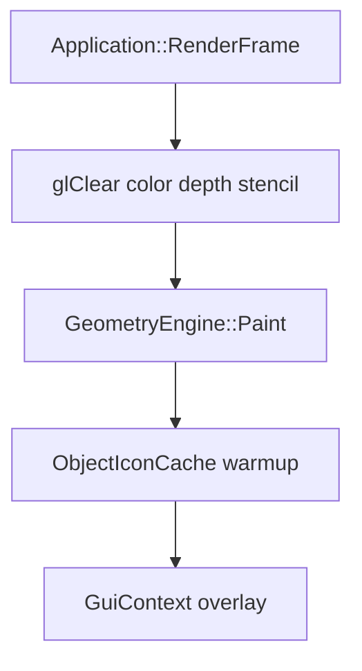

# Рендеринг мира (`src/Render/Pipeline/`)

Папка содержит **общие примитивы OpenGL** и **прозрачный greedy-пайплайн** для Cubatarium. HUD, меню и текст остаются в `GeometryEngine` / `Gui/` — сюда не переносятся.

## Порядок кадра (InGame)

Внутри `DrawCubeGeometry` (greedy mesh):

1. **Opaque** — `DrawGreedyOpaqueBatches`
2. **Transparent** — `GreedyTransparentPipeline::Draw` (4 прохода, см. ниже)
3. Outline / HUD — в `GeometryEngine::Paint` после мира

## Контракт OpenGL

**Перед `Paint()`** (`Application::RenderFrame`):

- FBO 0, viewport, `GL_DEPTH_TEST` + `GL_LESS`, `glDepthMask(GL_TRUE)`
- `glClear(COLOR | DEPTH | STENCIL)`

**Прозрачность** сама сохраняет/восстанавливает depth/stencil/color mask через `GlStateScope`.

**FBO-иконки prefab** обязаны использовать `GlStateScope(kGlMaskIconFbo)` — иначе сломается мир в следующем кадре.

## Четыре прохода прозрачности

Реализация: [`GreedyTransparentPipeline.cpp`](GreedyTransparentPipeline.cpp), таблица: [`TransparentPass.cpp`](TransparentPass.cpp).

| Проход | depth | depthWrite | color | stencil | Шейдер | Назначение |
|--------|-------|------------|-------|---------|--------|------------|
| ShellDepth | LESS | on | off | REPLACE 1 | ShellDepthPrepass | «Оболочка» в depth + метка stencil |
| BehindShell | GREATER | off | on | EQUAL 1 | TransparentColor | Полупрозрачное **за** оболочкой |
| ShellSurface | LEQUAL | off | on | EQUAL 1 | TransparentColor | Плотная часть грани |
| FuzzyEdges | LESS | off | on | NOTEQUAL 1 | FuzzyOnly | Мягкие края (α &lt; shellAlpha) |

Порог оболочки: `GreedyTransparentSettings::shellAlpha` (по умолчанию **0.35**). Выше — плотнее оболочка, меньше «дырок» в mutual occlusion.

## С чего начать при баге

| Симптом | Смотреть |
|---------|---------|
| Вода видна **сквозь камень** | `BehindShell` + stencil (должен быть EQUAL 1, не рисовать где stencil 0) |
| Нет **затемнения** между водой/стеклом | `ShellDepth` + `ShellSurface` |
| Не видно **стекло за водой** | `BehindShell` (GREATER) + сортировка в `GreedyTransparentSort.cpp` |
| Мир «ломается» после HUD/иконок | `GlStateScope` в `ObjectIconCache`, `Application` clear stencil |

Включить лог проходов: `GreedyTransparentSettings settings; settings.logPassNames = true;` перед `GreedyTransparentPipeline::Draw`.

## Правила `#include` (слабая связность)

| Можно | Нельзя |
|-------|--------|
| GLEW, glm, `ChunkMeshCache.h`, `Render/Pipeline/*.h` | `GeometryEngine.h` |
| `ShaderProgram` (forward declare) | `Gui/*`, `Application.h` |

`GreedyTransparentPipeline` знает только **`IUGreedyTransparentBackend`** — реализация в `GeometryEngine`.

## Файлы

| Файл | Роль |
|------|------|
| `GlStateScope` | RAII save/restore GL |
| `GreedyTransparentSort` | Сортировка прозрачных батчей (fluid → default → cross) |
| `TransparentPass` | Имена и параметры 4 проходов |
| `GreedyTransparentPipeline` | Цикл проходов + blend/cull |
| `IUGreedyTransparentBackend` | `PrepareTransparent` + `DrawPreparedTransparent` |
| `GreedyShaderMode` | Режимы fragment shader (`uGreedyShaderMode`) |
